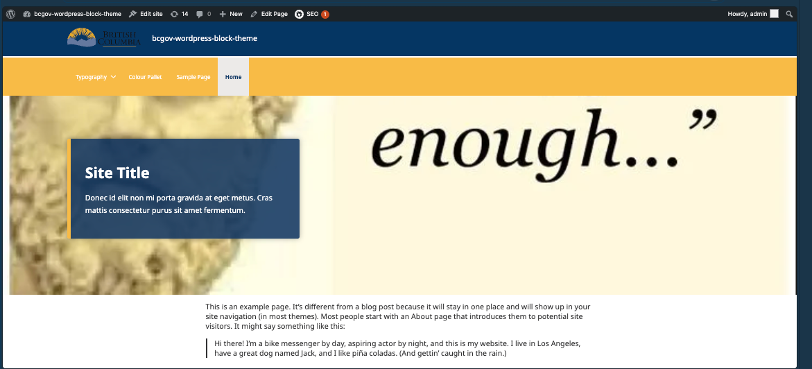
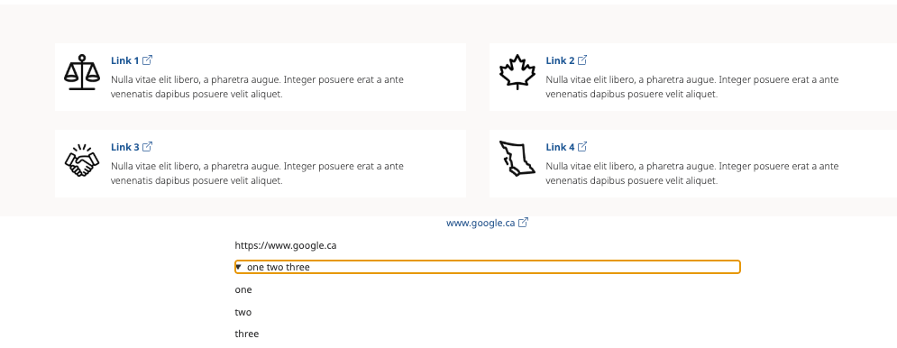

## Full Checklist — build

- [x] `npm ci && npm run build` passes

## Full Checklist — front of the website
- [x] Home page, inner page, and a blog post loads 

- [x] BC Sans font still correct
- [x] Header, footer, menu still work (desktop + mobile)
- [ ] Notification banner (if used): verify it displays
  - Not verified; banner also not working in test environment.
- [x] If you use external link icons: they still show

  - works with button block (using link style)
  - works with core/read more block
- [x] If you have a Collapse/accordion block on a page: it still opens and closes
- [x] no obvious layout breaks on desktop/mobile

**Full Checklist — editor**
- [x] Site Editor opens
- [x] Templates & Template Parts open
- [x] Can Edit and save a page
- [x] Card block works (add one, save, check front of site)
- [x] Collapse block works (add one, save, check front of site)
- [x] Enhanced button block still works
- [x] One BCGov pattern inserts correctly ()
- [x] You can save a page/template without errors

**Full Checklist — admin**
- [x] BCGov settings page still loads
- [x] Theme Options page loads