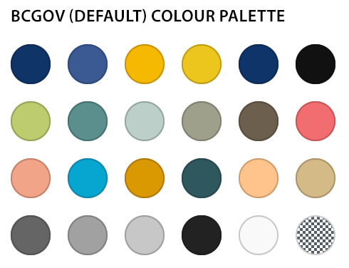

# General Information

## Theme Options and Block Theme Settings

Changing theme behaviours in Theme Options
The BCGov Block Theme allows you to change some of the behaviours of the site such as theme styles and how the header behaves. These are coupled with the Block Theme Appearance settings. Simply go to the Theme Options page in the site admin area and choose the behaviours you wish to use.

- [x] Choose the active site styling – this choice will impact how certain features display or are made available.
- [x] Change the behaviour of the site header bar when using the Takeover Menu.
- [x] Enable optional styles and patterns available to the current site.
- [x] Enable a custom body class for site specific style overrides.
[x] Add custom content security policy overrides.

More detail on these features can be found on the  **Appearance > Theme Options**  page.

### BCGov Block Theme Settings

Some features will need to be turned on to become available to the admin environment. These include the Custom Notice Banner feature and the Custom Patterns. Such available options will change over time, so be sure to review this area to determine the latest settings available to the BCGov Block Theme environment. These will be turned off by default in a new installation. For more information on these options see their respective sections below.

Other settings for admin enabling options in the Block Theme can be found on the  **BCGov Block Theme Settings**  page

## General editing and layout
### Understanding the role of margins and padding in the WordPress editor

The WordPress environment allows for responsive padding and margins by using the slider mechanism.

1. First, open the page or post where you want to adjust the padding or margin. Once you're in the editing mode, select the block you want to adjust.
2. On the right-hand side of the editor, you should see a panel called "Block settings". Look for the "Spacing" section within the panel.
3. Within the "Spacing" section, you'll see two sliders: one for margin and one for padding. You can adjust these sliders to change the amount of margin or padding around the block.
4. The margin slider controls the space outside the block, while the padding slider controls the space inside the block.
5. You can either adjust the sliders by dragging the handles or by clicking on the number and typing in a specific value.
6. As you adjust the sliders, you'll see the changes reflected in real-time on the preview of your page or post.

### Linked vs unlinked

The link sides icon allows you to choose to apply the same settings to all sides or break them out individually. In some situations you may have access to all sides (top, bottom, left and right) or you may only have top and bottom. In some circumstances you may only have access to padding or margin but not both. And in other cases the padding and margin option may not be available. It is up to you to use combinations of containing blocks such as groups, rows, columns, etc. to find the right layout pattern for your desired look and feel.

 **Warning:**  Be careful when using margins and padding in the editor and setting your own sizes. Using explicit sizes – eg: 2rem, 1.5em or 18px – are one size fits all (or doesn’t fit as the case may be). Any padding or margin spacing added to any element, layout, pattern or block is going to display similarly across all resolutions. 6rem of margin on a desktop view may look good, but can add a lot of unwanted spacing on mobile devices.

### Fluid Typography

This feature enables font sizes to adapt to changes in screen size, for example, by growing larger as the viewport width increases, or smaller as it decreases. You will find this control in most text based block inspector options.

It is still possible to set the size of text or headings in hard coded values by setting a custom size, however much like the margins and padding issue above, it does not scale responsively so use it with care and test across all screen sizes from desktop to mobile.

## Patterns and Custom Patterns

### Instructions

WordPress block patterns are a collection of pre-made design elements that you can use for creating custom content layouts faster. These patterns include items like pre-built multi-column layouts, media and text patterns, call-to-action patterns, headers, buttons, and more.

To use block patterns, you need to edit the WordPress post or page where you want to use the block pattern. On the page/post edit screen, click on the Add Block button to open the block inserter. From there, switch to the Patterns tab to view available block patterns.

You can also view BCGov specific block patterns in different categories like general, headers, footers, pages, and more including any site specific patterns developed specifically for sites such as CleanBC.

### Understanding Patterns

- [x] Patterns are combinations of core block components and custom classes set up in very specific configurations.
- [x] Patterns are typically designed to be discreet page specific sections and are not meant to be combined within other patterns.
- [x] Patterns are usually contained in a Group block at its top most level when using the List View.
- Pre-defined styling can be changed by moving or altering pattern structure while others may cause design failures.
- Be very cautious moving patterns into other patterns.

### BCGov Block Patterns

Patterns are separated into different categories such as General, Banners, Header/Footer, Page Layout, Post Queries, etc. These categories are used to separate intended purpose and also keep the list of patterns from getting too large and inhibit browsing. Should you know the name of a pattern you can use the search tool in the Block Inserter to filter and find the one you need.

Many patterns are available for use as part of the default BCGov base theme. They offer layouts such as Alternating Cards, Card with Image Overlay, Card with Under Image Portrait 2-Up, Cards Portrait 3-up, Detail Card with Icons, Hero Banner, Long Card, Quote, Small Quote with Image, and many more.

### Creating Custom Patterns

Enabling printing of an imageIn the site admin click on "Patterns", this will bring up the list of custom patterns currently in your site, or it will be empty if starting new.

Use the "Add new" button to begin building a custom pattern. Enter a name for the pattern and then build it as you would any other layout using the blocks or elements you want to include in your custom pattern.

Once you've arranged the blocks to your liking, click on the "Publish" button to save your pattern.

### Adding custom patterns to the pattern chooser

To add your custom pattern to the Pattern chooser, you need to add a new or existing "Pattern Group" located on the Custom Pattern tab of the block inspector area. Click on the "Add New Pattern Group" link or choose from any of the options listed.

Enabling printing of an imageIf creating a new group enter a "New Pattern Group Name" for your new pattern group and select the group option you just created.

Click on the "Publish" button to save your new pattern category.

Your custom pattern will now be available in the Pattern Chooser under the category you just added. It will come prefixed with the "Custom: " label, so if your group was called My Great Patterns, in the pattern chooser it will be labelled "Custom: My Great Patterns."

### Making custom patterns searchable

You may have noticed at the top of the block and pattern chooser the ability to search for existing blocks and patterns. To make your pattern easily findable without browsing to it you can add keywords to aid in finding your pattern.

Add any keywords you feel make for better searchability to the "Add Related Search Term" under the "Search Related Terms" section found directly below the Pattern Groups.

## Site Specific Patterns

Site specific patterns developed specifically for sites can also be inserted from their patterns. Look for categories that identify the site by name. These patterns can be modified once applied to the page and can either be set up as a Reusable Block or alternatively can be copy/pasted between pages or sections once altered.

## Site Specific Blocks and Block Styles

Site specific blocks and block styles can also be inserted. Look for styles that identify the variations or options.

### Buttons and Button Blocks

Buttons are used extensively as key drivers of linking to other pages and content. While inline linking can be done inside text paragraphs, headlines, etc., buttons offer some additional features that make them extremely useful when building sites.

- [x] Buttons have multiple style options from filled, to outlined or underlined and can be fully customised from colour to sizing in the block editor.
- [x] They have additional Accessibility features that enable better keyboard navigation experiences, but also allow for custom ARIA labels to ensure screen readers or other Assistive Technologies can benefit from proper context.

## Colour Palettes

Colour palettes for the BCGov Block Theme are made up of 24 predefined colours. Any additional Active Site options will also include a palette with an equivalent number of colours in order to make the patterns usable across sites. An associated group of Gradients based on the 16 essential custom colours in the colour palette are also available.

It should be noted that most blocks and patterns can be modified in the editor to override colour or gradient palette options to accommodate specific customisation needs.

### Instructions

Global Styles Switcher allows users to switch the theme defaults to alternate colour palettes. Open Appearance > Editor in the admin. You should see the theme variations in the global styles switcher by clicking on the styles icon in the top right corner.

## Print Specific Controls

### Enabling images to print

To show an image when printing, or set the width of the image on a printed page, follow these steps:

1. Select the image on which you want to add these settings.
2. In the Block Inspector, click on the "Other media settings" heading.
3. To show the image when printing, check the box next to "Show image when printing".
4. To set the maximum width of the block when printed, enter the desired width value in the "Max width on printed page" field as a % of the printed page width.

By default images do not print. If you have an image that conveys information, such as a graph, and want it to print, you will need to enable this by selecting the  **Image block or the Media & Text block**  (currently the only two blocks supporting printing images).

Using the "Max width on printed page (%)" slider or its related number field will set the percentage an image takes on the printed page. This range can be from 10% to 100% of the printed page width and is set to a default of 25%.

Once you have set these options, you can preview the block to see how it will appear when printed.

## Accessibility specific controls

### Adding Aria labels to buttons

Aria labels, or Accessible Rich Internet Applications (ARIA) labels, should be used to enhance the accessibility of web content for users with disabilities. To this end when using buttons an option to add an Aria label is available in the Block Inspector panel.

ARIA labels can provide additional context to assistive technology users, such as screen readers, in understanding the purpose and function of various elements on a webpage.

ARIA labels should be concise and descriptive and should be used when the button label does not provide context as to the purpose of the link itself. For example a typical use case is a series of cards that simply say "Learn more" or "Read more". In this situation the Aria label should include the context of the link that the label fails to provide.

# Advanced Theme Management

## Customisable Templates

- [x]  **Page:**  displays a single page with the standard layout
- [x]  **Page – Content only:**  allows for custom banners, requires in-page breadcrumb navigation block if used on site
- [x]  **Blank:**  no default header, content or footer – for use in creating custom landing pages
- [x]  **Search:**  display results page
- [x]  **404:**  displays when no content is found, provides customisable 404 information

### Instructions

The theme editor allows for the customization of the BCGov WordPress theme without writing any code, and modifying page templates without breaking the website. This page is not meant for in-depth instruction in using the theme editor, just know the full site editor is a powerful and flexible way to customise the BCGov Block theme and will allow for making substantive changes to a theme and its layout at any time. This enables a level of flexibility which allows you to easily create on-demand page layouts. For more information regarding WordPress 6+ Templating see:

## Customisable Template Parts

- [x]  **BCGov Header (Standard)**  adds typical BC Gov blue header with site logo, title, navigation and search
- [x]  **Navigation:**  adds menu navigation to the header
- [x]  **Search Field:**  adds search field to the header
- [x]  **Breadcrumb Nav:**  adds breadcrumb navigation, requires AIOSEO plugin activation
- [x]  **BCGov Footer (Standard):**  adds typical BC Gov blue footer

### Instructions

Template parts are used to organise a theme in smaller reusable structural parts. They are commonly used for site headers and site footers. Just like templates, the theme editor allows for the customization of the BCGov WordPress theme without writing any code and this includes modifying template parts.

The Site Editor’s Template Parts section displays a list of all template parts. You can create template parts using the Add New button. In this view, you can also clear customizations from theme template parts and delete user-created template parts should an error be made while editing inside the editor.

## Custom Notice Banner

A notification banner on a website is a useful tool that can serve various purposes, including communicating important announcements, informing users about promotions and offers, providing urgent updates such as website maintenance, and acting as a call to action for users.

The Custom Notice Banner can be enabled in the BCGov Block Theme Settings page and is to be used when a notification banner is required to relay a message of some importance. When enabling the notification banner on the website, it is essential to ensure that the message is clear and concise and does not detract from the overall purpose of the site itself.

Settings for the custom notice banner

1.  **Enable Admin Notification:**  Show or hide the banner on the site.
2.  **Homepage only:**  This refers to a setting that allows the banner to be displayed only on the homepage and not on other pages.
3.  **Status (colour):**  The colour used to indicate the status of the message. A number of colour options are available (which can be seen in the image above) and utilise preset colour options that conform to digital accessibility standards for contrast.
4.  **Embolden / Embiggen:**  These terms refer to the act of making the banner content appear more prominent by increasing the font size or bolding the text.
5.  **Notification content:**  This refers to the message or information displayed in the notification banner itself, such as an alert or banner, that is meant to grab the attention of the user.
6.  **Enable button:<**/ > Show or hide the button inside the banner.
7.  **Button Label:**  This is the text that appears inside the button.
8.  **Accessibility button label:**  This is the text that is read by screen readers to describe the purpose or function of a button to users with disabilities. It is important to ensure that this label accurately reflects the button's purpose to ensure accessibility.
9.  **UTM Campaign:**  A UTM campaign is a set of parameters added to a URL to track the effectiveness of online marketing campaigns. If the button is meant to track click throughs to a specific campaign, add its UTM identifier here. It is ok to leave this empty.

- [ ] When enabled, the positioning of the banner in the page will be based on whether the header is fixed or scrolls with the page. For fixed headers it will appear below the header. For scrolling headers it will appear above.

## Using Polylang for translations

### Adding the Language Switcher to navigation

Adding the Polylang Language Switcher is accomplished in the Template editor. It is best to associate the switcher with the site Navigation or main menu, but as of Polylang Pro version 3.2.8 the "Language switcher" block which enables the ability to move between languages. The language switcher block can now integrate directly with the main menu navigation if using the "ribbon navigation" styling. If the site design does not use the ribbon navigation, the site administrator needs to be creative with placement and layout.

### Instructions

Add the Language switcher block to the same group or row as the Navigation menu and align it as desired.

With the Language switcher block in place choose the display options that best suit the desired look and feel. The primary options are as either a) a drop select or b) a list view.

 **Note the 'Displays as a dropdown' option must be deactivated to behave as a menu rather than a select box in sites that use the 'ribbon navigation' template part.** 

### Polylang translation of template parts

On sites where you wish to translate page elements in the header, footer or menus, if they are based on template parts, you will need to decouple (or detach) them from the template part system prior to adding a translation.

Detach the template part prior to translation – this is typically done in the Full Site Editor area under  **Appearance > Editor (beta).** 

If this is not done, Polylang and the Block Theme will not only fail to generate translations, but it will cause the site to generate many additional templates of the same name. This bug may be resolved at some point by the Polylang developer but until that happens detaching template parts is the only way to ensure you will be able to translate this content.

# Content Security Policy (CSP)

### What is a Content Security Policy?

A Content Security Policy (CSP) is an added layer of security that helps protect your website against cross-site scripting (XSS) attacks, data injection, and other types of code injection attacks. CSPs work by specifying which types of content can be loaded and executed on a website, and from which sources they can be loaded. This can help prevent malicious scripts from running on your website, as well as reduce the risk of data theft and other types of attacks.

### How to Identify What Exception is Needed for a Custom Security Policy Exception

If you need to add a Custom Security Policy Exception, follow these steps to identify what exception is needed:

1. Determine which specific resources or elements on your website are being blocked by the CSP. You may need to check the browser console or network tab for details on which resources are being blocked.
2. Once you've identified the specific resources or elements that are being blocked, determine which type of exception is needed to allow those resources or elements to be loaded. For example, you may need to add an exception for a specific domain or subdomain, or you may need to allow a specific type of resource (such as scripts, images, or stylesheets).
3. Once you've determined what type of exception is needed, navigate to the Custom Security Policy Exception form in your site Simply go to the Theme Options settings.
4. In the Custom Security Policy Exception form, enter the specific details of the exception that you need to add. This may include the domain or subdomain that needs to be allowed, the specified resource type that needs to be allowed, and any other relevant information.
5. Once you've entered the details of the exception, click the "Save Changes" button to save the exception to your site's CSP.