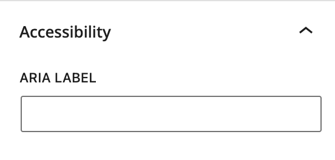

# Accessibility

## Adding Aria Labels to Buttons

Aria labels, or Accessible Rich Internet Applications (ARIA) labels, should be used to enhance the accessibility of web content for users with disabilities. To this end when using buttons an option to add an Aria label is available in the Block Inspector panel.

ARIA labels can provide additional context to assistive technology users, such as screen readers, in understanding the purpose and function of various elements on a webpage.

ARIA labels should be concise and descriptive and should be used when the button label does not provide context as to the purpose of the link itself. For example a typical use case is a series of cards that simply say "Learn more" or "Read more". In this situation the Aria label should include the context of the link that the label fails to provide.