# Getting Started

Welcome to this tutorial on getting started with the Block Theme. The goal of this tutorial is to teach you the basics of using WordPress. After a brief introduction, we'll cover initial site setup, creating pages, creating posts, and changing the appearance of your site.

**Note: If you wish to use posts, you will need a post feed in order for them to be visible to the public. You can find information on using the Query Loop block - which creates this feed - in another tutorial: [Using Custom Post Types](./using-custom-post-types.md).**

## 1. What is WordPress and why do we use it?

Self-hosted WordPress, also known as WordPress.org, is a free CMS (Content Management System) used to design websites. Although it was originally intended as a tool to publish blogs, WordPress has gained traction and evolved into a tool for quickly creating websites for businesses and governments. It is also a simple and free platform to use for developers, which has led to a multitude of plugins and themes.

We have harnessed the power of WordPress with our own theme, The Block Theme. This custom theme has many features, templates, and patterns that allow you to quickly create websites that match the BC Government Design System. While creating the theme, we've made special considerations for accessibility, such as compatibility with screen readers, WCAG-approved contrast ratios, and keyboard controls.

Combining these things together, we offer empowerment to content creators: the ability to manage their own work without added layers of frustration and complexity. So let's get started on your WordPress journey.

## 2. Initial Setup

Before we start creating content, there are some basic settings that we should check on. We can start by logging into WordPress. To get to the login screen, simply type in the address for the website and add "/wp-admin". *Example: https://blog.gov.bc.ca/yourwebsite becomes https://blog.gov.bc.ca/yourwebsite/wp-admin*. Once you're at the page, you can enter your IDIR name and password to get to the WordPress Dashboard (see figure 2.1 and 2.2). The Dashboard is the place where all sections of this tutorial will start.

### General Settings

Our first step will be to hover over "Settings" in the left bar and select "General". There are some values in this screen that are important to update:

- **Site Title**: The name of your website as it appears in search results
- **Tagline***: A brief description of your main purpose.
- **Administration Email Address**: Make sure this value is set to "govwordpress@gov.bc.ca".
- **Timezone**: You can set this to the local time zone of your office.

See figure 2.3 for a look at the General Settings page.

### Comment Settings

If you intend to have comment sections on your website, this part is important. There are several settings in here for your comments, including whether or not users can submit comments on posts, whether the comment author must fill out name and email, and which words are forbidden in comments. The scope of the commenting options is too large to explain in this guide, but they are in plain language and shouldn't be too hard to figure out. Set the options as needed.

### Permalink Settings

There are several ways to structure the permalinks for your site. The permalinks are the URLs for your pages. You can access options for permalinks by going to Settings > Permalinks from the WordPress Dashboard. It is suggested that you use the "Post name" setting, because it generates a permalink that is descriptive to the user (see figure 2.4).

### Selecting a Theme

The BC Gov Block Theme should be selected by default, but we should make sure that it is. You can do this by hovering over "Appearance" and selecting "Themes". If you see the BC Gov Block Theme logo with the text "Active" in the bottom left, the Block Theme is already active and you have nothing to do here. If another theme is active, simply hover over the Block Theme icon and select "Activate" (see figure 2.5).

### Enabling Default Plugins

I will start this section by mentioning that you should not activate plugins yourself unless you have permission from Digital Engagement Solutions. However, there are a few plugins that need to be enabled in order for the Block Theme to function properly. Let's select "Plugins" in the left menu bar from the WordPress Dashboard. The following plugins should be activated with a blue background (see figure 2.6):

- **Advanced Custom Fields**: A plugin that allows us to generate custom fields.
- **All in One SEO**: A plugin that makes your website appear correctly in search results.
- **BCGov Common Plugin**: Our own plugin that includes important tools for our developers.
- **Custom Post Type UI**: A plugin that allows us to make custom post types and taxonomies.

If any of these plugins are disabled, you can press the "Activate" text under its name. Do not activate or deactivate any other plugins without permission. This is very important.

**Note: You may find that your account does not have sufficient privileges for viewing, enabling, and disabling plugins. If this is the case, you can skip this step for now.**

<table>
	<tr>
		<th>Figure 2.1</th>
		<th>Figure 2.2</th>
		<th>Figure 2.3</th>
	</tr>
	<tr>
		<td>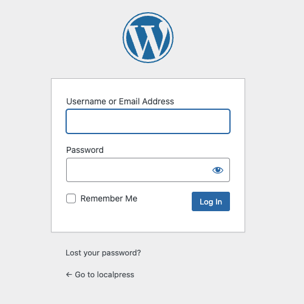</td>
		<td>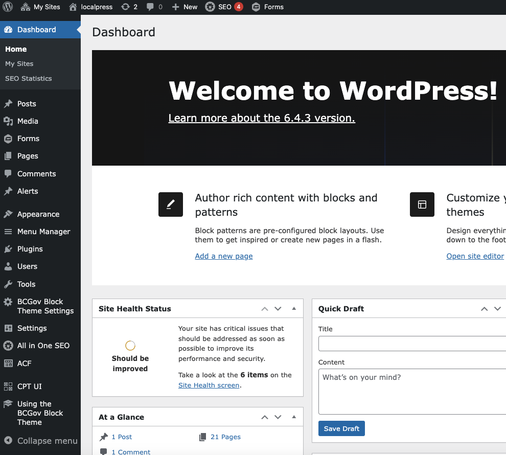</td>
		<td>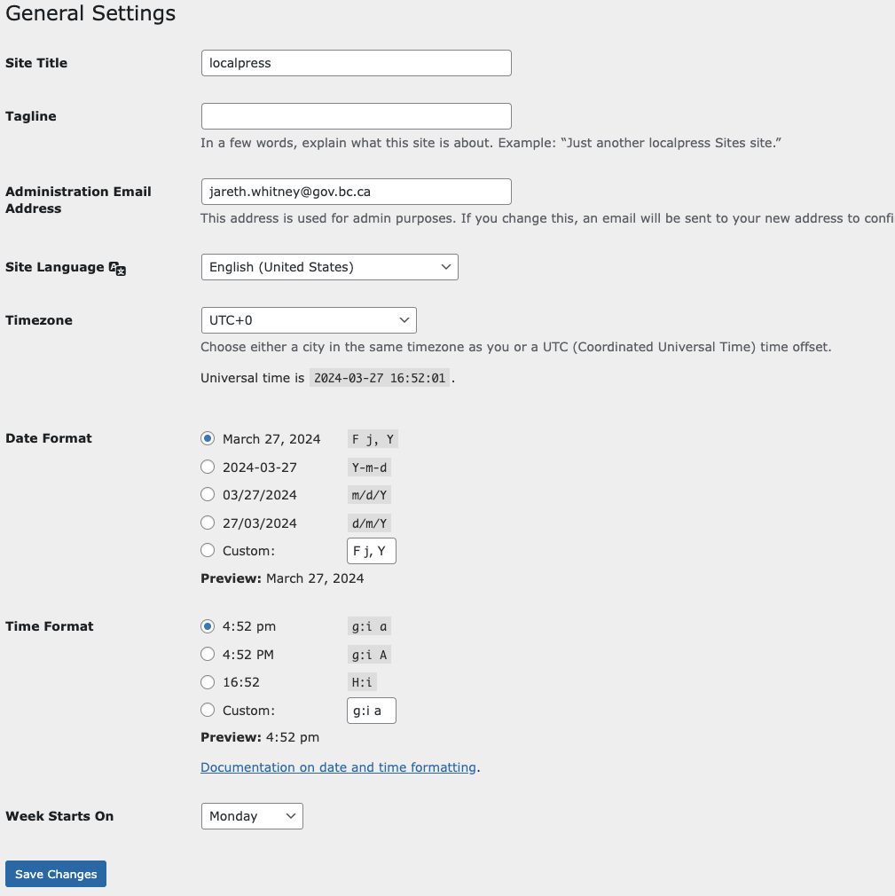</td>
	</tr>
	<tr>
		<th>Figure 2.4</th>
		<th>Figure 2.5</th>
		<th>Figure 2.6</th>
	</tr>
	<tr>
		<td>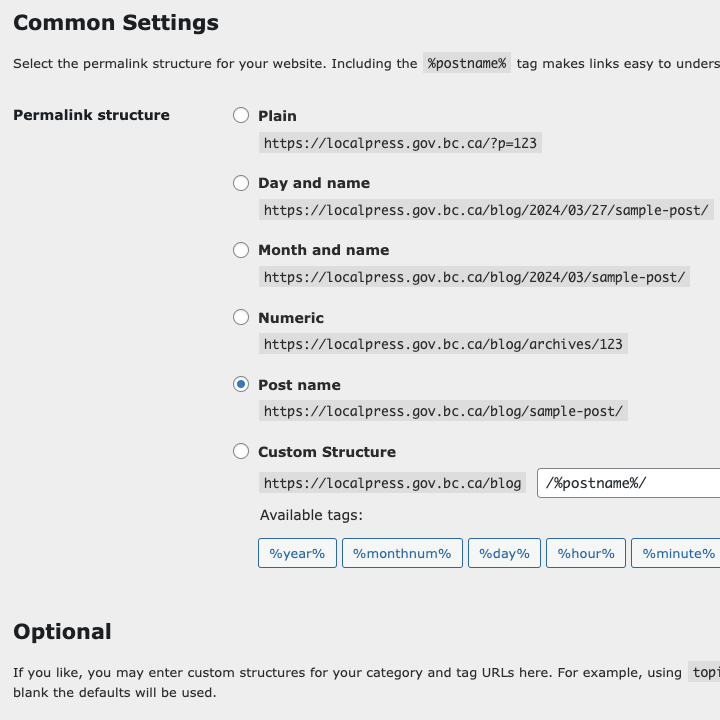</td>
		<td>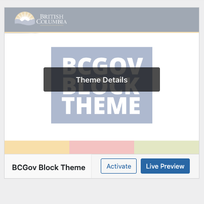</td>
		<td>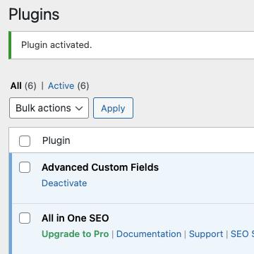</td>
	</tr>
</table>

## 3. Creating Pages

We've taken care of our basic site settings and it's time to create our first web page. We can do this from the WordPress Dashboard by going to "Pages". From Pages, click on the "Add New Page" button at the top of the screen (see figure 3.1). This will bring us to the Gutenberg Editor.

But what is the Gutenberg Editor? Here is the description from the *wordpress.org* website:

> Gutenberg is WordPress’s 'block editor', and introduces a modular approach to modifying your entire site. Edit individual content blocks on posts or pages. Add and adjust widgets. Even design your site headers, footers, and navigation with full site editing support.

> Each piece of content in the editor, from a paragraph to an image gallery to a headline, is its own block. And just like physical blocks, WordPress blocks can be added, arranged, and rearranged, allowing users to create media-rich content and site layouts in a visually intuitive way — and without workarounds like shortcodes or custom HTML and PHP.

> We’re always hard at work refining the experience, creating more and better blocks, and laying the groundwork for future phases of work. Each WordPress release includes stable features from the Gutenberg plugin, so you don’t need to install the plugin to benefit from the work being done here.

I will show you how to do some basic things in the Gutenberg Editor. If you would like to learn more, check out the <a href="https://developer.wordpress.org/block-editor/">WordPress Block Editor Handbook</a>.

### Page Setup

First, let's give this page a title. We'll enter the text "My Great Page" where it says "Add title" in the editor. 

Before we start placing blocks, let's choose a page template as well. Page templates are important because they determine the styling for page content container. One template will automatically add the title text to your page, while the other two will not. You can change the page template on the right side of your screen, in the settings bar. Make sure the Page tab is active at the top of the settings bar (as opposed to Block), and click on the blue text beside Template (see figure 3.1). You should have similar options to these:

- **Default Template / Pages**: The default page template, including an automatically generated h1. Modifiable as the "Pages" template in Dashboard > Appearance > Editor > Templates > Pages.
- **Page - Content Only**: A page that does not have an auto-generated h1. Modifiable in Dashboard > Appearance > Editor > Templates > Page - Content Only.
- **Blank Page or Post**: Exactly as the title says, a blank slate.

For now, let's choose "Page - Content Only" and start creating our page.

### Using Block Theme Patterns

There are several fully styled patterns that come with the Block Theme. We suggest that you utilize these patterns whenever you can in order to minimize styling work. In the middle of the screen, you should see some text that says "Type / to choose a block". Click on the plus button to right of that text and follow these instructions:

1. When the pop-up menu appears, click on "Browse all" (see figure 3.2).
2. This will open a new menu on the left. Switch to the Patterns tab (see figure 3.3) to see the patterns.
3. There will be several categories to choose from. Select BCGov: Page Layouts.
4. Choose the pattern with the fruit pictures. A full-page layout should now appear in the main part of the editor.

Now that we have the basic elements of our page, we can modify them.

5. Click on the title text in front of the cover image and change the title to "My Great Page" (see figure 3.4).
6. Change the sentence below the previous text to something like "Thank you for taking the time to look at my great page."
7. Now click on the button below and change the text from "Learn More" to "Visit Google".
8. You should notice a floating menu above your text. Highlight all the "Visit Google" text and select the link icon above (see figure 3.5).
9. Type in the URL "https://www.google.ca" and press the ENTER key.

You can use these principals for replacing the rest of the content on this page, including the images, text, buttons, and even videos in some cases. But what if you don't like part of this template? Let's try replacing the next section with something else.

10. Click on the icon that looks like three slanted horizontal lines (or a tilted hamburger) in the upper left of your screen (see figure 3.6).
11. This will open the Document Overview bar in the left. 

**Note: The Document Overview bar is very important; it shows you the structure of the blocks on your page. In the Document Overview, you will see a list of block names with arrows to the left of them. The blocks that are all the way to the left in this list are at the highest level. Clicking on one of the right-facing arrows beside a block shows the blocks that are contained within it.**

12. In the Document Overview bar, select the second "Group" block that is all the way to the left, click on the three dots beside it, and select "Delete" (see figure 3.7).
13. This will remove the three-across call-to-action block that was placed in the editor. In the Document Overview, highlight the first "Group" block that is all the way to the left. This should be the breadcrumbs block. Now click on the plus button to the right of the breadcrumbs in the editor.
14. Like we did at the beginning, go to "Browse All" and switch to the "Patterns" tab on the left.
15. Go to "BCGov: Alpha V3" and select the item that looks like a 2x2 grid of icons and text (see figure 3.8). It will be inserted into your page in the editor.

This pattern would work well as an index or a list of links. The last thing we're going to do in this section of the tutorial is replace an image. For this, you will need to upload at least one image from your local drive. If you don't have anything available, I suggest visiting a royalty-free image site like <a href="https://www.pixabay.com">Pixabay</a>.

1. Select the large image of an orange that is cut in half.
2. From the floating menu, select "Replace" and then "Upload" from the menu that appears (see figure 3.9).
3. You will be prompted to browse your local files for an image. Find the image that you downloaded and select it, then select "Open".
4. The new image will replace the image of the orange.

Congratulations, you've created something that looks great in no time at all. You've learned how to change titles, text, buttons, links, and replace blocks/patterns. Feel free to experiment more with the different tools in the editor. When you're done, press the "Save draft" button in the top right and return to the WordPress Dashboard by pressing on the rectangle in the very top left of your window.

But what if you want to create something from scratch? The next section will cover that.

<table>
	<tr>
		<th>Figure 3.1</th>
		<th>Figure 3.2</th>
		<th>Figure 3.3</th>
	</tr>
	<tr>
		<td>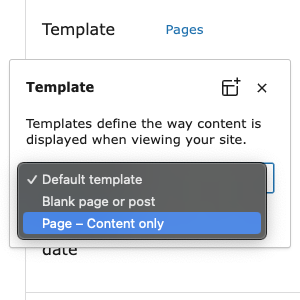</td>
		<td>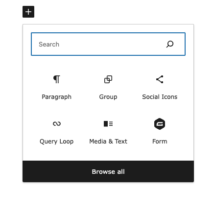</td>
		<td>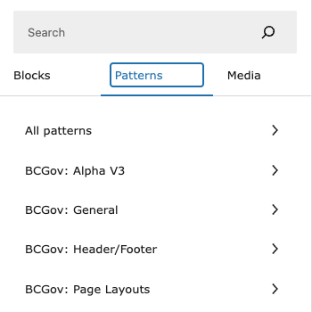</td>
	</tr>
	<tr>
		<th>Figure 3.4</th>
		<th>Figure 3.5</th>
		<th>Figure 3.6</th>
	</tr>
	<tr>
		<td>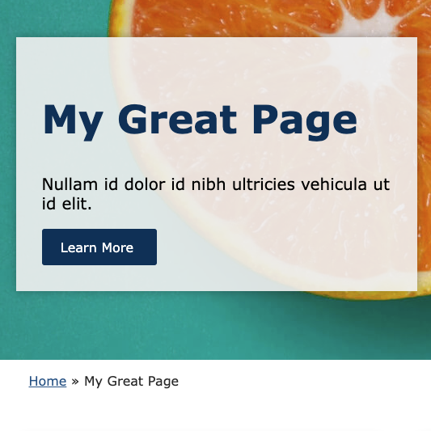</td>
		<td>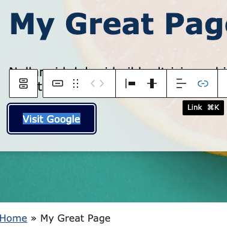</td>
		<td>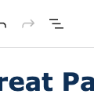</td>
	</tr>
	<tr>
		<th>Figure 3.7</th>
		<th>Figure 3.8</th>
		<th>Figure 3.9</th>
	</tr>
	<tr>
		<td>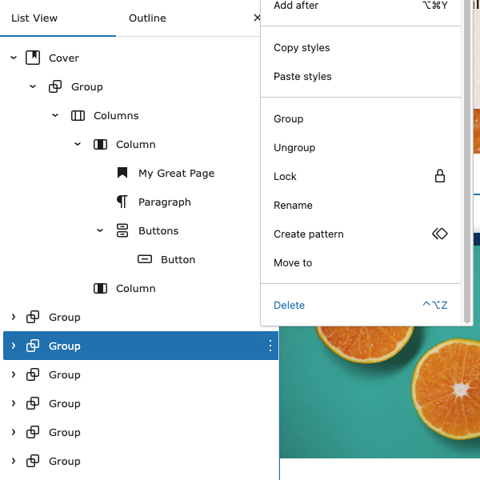</td>
		<td>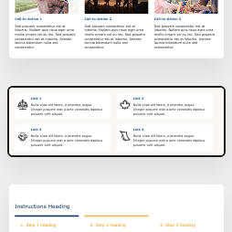</td>
		<td>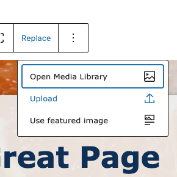</td>
	</tr>
</table>

### Making a Page from Scratch

Now that you know how to utilize the Block Theme patterns, let's create something from scratch using the built-in WordPress blocks. We have enhanced some of these blocks for the Block Theme to include extra options and functionality.

1. Use what you've just learned to create a new page. If you need to peek, look at the "Page Setup" section.
2. In the Gutenberg Editor, enter a title for your page like "My Second Great Page" and change the page template type to "Blank Page or Post". You can peek at the "Page Setup" section again for help.

That covers the setup, now let's experiment with some of the built-in Gutenberg blocks.

3. First thing's first, we need to create a container so that we control how our content is formatted. Click on the plus button.
4. On the floating block-selection menu that appears, filter the list by typing in "group" and then select the Group block.
5. When the group block appears, you will have to select between three different layouts. For our purposes, choose the single rectangle on the left (see figure 3.10).
6. In the right settings bar, make sure that "Inner blocks use content width" is enabled and enter "1440" inside the "Content" box.
7. Click on the rectangle that you just created and notice the floating menu above it. Click on the icon that looks like three lines on the floating menu and select "Full width" (see figure 3.11).
8. Now let's go back to the settings menu on the right and switch to the tab that looks like a half moon (see figure 3.12).
9. Click on "Background" and choose a navy-blue colour from the colour picker.
10. Click on the plus symbol in the middle of your Group rectangle and search in the floating block-selector menu for "title". Select the Title block.

**Note: The Title block will automatically insert the page title in your page (the one you just created at the top of the editor).**

11. With the Title block selected, look to the right settings menu again, and switch to the Styles tab (icon that looks like a half moon).
12. Under "Colour", click on "Text" and select a colour similar to white from the colour picker.
13. From the floating menu, select "H2" and change it to "H1".

Excellent, we've created a stylized H1 heading for our page. Now, let's create some content.

14. Click in the editor below the header that you just created and create another Group block by following steps 3 through 7.
15. Let's create an opening paragraph. Click on the plus symbol inside the new rectangle, then search for "paragraph" from the block-selector floating menu. Select the Paragraph block.
16. Enter a paragraph of text here. The content doesn't matter. You can copy and paste from another website, for example.
17. Now let's stylize this paragraph to give it more impact. Go to the right settings bar, make sure the "Block" tab is active, then click on the three dots beside typography and select "Line Height" (see figure 3.13).
18. Raise or lower the value with the plus and minus buttons until you feel the text is properly spaced out.
19. Open the Document Overview bar on the left by clicking on the icon with three offset horizontal lines again.
20. Select the second Group block in the list. In the right settings bar, switch to the Styles tab (half-moon icon).
21. In the right settings bar, scroll down to Padding. In the first row, change the value from "Default" to "Medium". In the second row, change the value from "Default" to "Large".

We've created a paragraph at the top of our page, and we've added importance to that paragraph by adding space around it. Now we're going to insert a pattern underneath our paragraph. I know that this section of the tutorial is about creating a page from scratch. However, even if you want a page style that is highly customized, using smaller patterns can save you time with styling, and you can still achieve a unique look.

22. Click on the plus button below your paragraph, select "Browse all", switch the left menu to the "Patterns" tab, go to the "BCGov: Alpha V3" category, and select the 3x3 grid with the title "Your questions, answered."
23. Change the text if you like. You can also remove the "Learn more" buttons by selecting them and pressing the DEL key.

The last section of our page will be the footer. This could be added with a template, but I'm going to show you how to make one quickly.

24. Open the Document Overview bar on the left again and select the first Group block in the list. Click on the three dots beside it and select "Copy".
25. Now select the Questions and Answers block from the Document Overview, click on the three dots to the right of it, and select "Add After".
26. Select the "Paragraph" block in the Document Overview and press the keys CMD+V (Mac) or CTRL+V (Windows). This will paste your h1 block at the end of your page.
27. Still in the Document Overview, expand the contents of the last Group block by pressing the arrow beside it.
28. Click on the three dots to the right of the Title block and select "Add after". 
29. You should see a plus button in the main editor. Click it and filter the floating block-selector menu by typing "navigation". Select the Navigation block.
30. Now click on the three dots to the right of the Title block and select "Delete".

That's the last piece - you've created a footer for your page. The list of links on your footer might not be impressive yet, but that will be updated automatically when we update the navigation menu in section 5 of this tutorial. Again, feel free to play around with what you have, experiment with the structure of the blocks, change the content. When you are all done, click on the "Save Draft" button in the top right of the window.

<table>
	<tr>
		<th>Figure 3.10</th>
		<th>Figure 3.11</th>
		<th>Figure 3.12</th>
	</tr>
	<tr>
		<td></td>
		<td></td>
		<td></td>
	</tr>
	<tr>
		<th>Figure 3.13</th>
		<th></th>
		<th></th>
	</tr>
	<tr>
		<td></td>
		<td></td>
		<td></td>
	</tr>
</table>

## 4. Creating posts

This section of the tutorial will cover the basics of posting in WordPress. But what is a WordPress post? Let's get into it.

WordPress posts were crucial in the success of the original WordPress CMS (content management system). Posts make it convenient to enter updates for content creators, whether the posts are blog posts, news articles, or critical business updates. The applications for post types are almost endless, but there are a few rules that you should keep in mind.

- Posts should be related to news updates of some kind. Don't use posts to store a catalogue of toothpaste types - we have custom post types for that. Those are covered in a separate tutorial.
- Make sure you want it to be your primary public-facing news source.

As long as your use case meets the above criteria, posts will be an appropriate content type on your website.

### Making a post

When you create a post, it will have its own page. But, in addition to that, it has the superpower of showing up in a feed. Imagine a news website. It has a news feed at the top of its homepage so that internet users can get quick details about multiple stories. A post feed will perform a similar function for your own website viewers. The post feed can be generated automatically and act as your homepage, or you can create a custom post feed on a page with the Query Loop block. Let's not get into the Query Loop block here, it's already been covered in another tutorial: [Using Custom Post Types](./using-custom-post-types.md).

Like pages, posts are constructed and edited with the Gutenberg Editor. Because of this, I will not go over specifics like formatting and using the blocks in custom ways. We have already covered that in the previous section. Let's rely on the default Block Theme template for styling. All we need to do is input a title, the content, and a featured image.

1. From the Dashboard, go to the "Posts" item in the left menu. From the posts page, click on "Add New Post" near the top of the page (see figure 4.1).
2. Set the template type to "Single Posts" in the right settings bar if it's not selected already.
3. Add a title to your post like "My Great Post".
4. Enter the content of your post below the title in the paragraph block.
5. You can enter other blocks in your post for other data types, like tables, ordered and unordered lists, captions, images, and more. All of these are available from the block-selection menu that comes up when you press the plus button.

Great, now let's add a featured image. The featured image may be viewable beside your post in the post feed. Keep this in mind.

6. In the right settings menu, make sure the "Post" tab is selected, then scroll down to "Featured Image" and click on "Set Featured Image" (see figure 4.2).
7. You can use an image in your Media Library if you like. Otherwise, click on the "Upload Files" tab and either drag an image in or click on "Select Files" for a Explorer/Finder window.
8. You will be given the chance to add alternative or "alt" text to your image on the right side of the Media Library. Please do! It's just a short description of the image.
9. Once you're done with your post, click on the "Publish" button.

### Viewing a post

As mentioned previously, every post has its own unique page. By default, these post pages won't be linked in your main navigation. Your users can usually access them by selecting the post from a feed. However, you may not want people to view these individual pages, and that's fine. They can be hidden from your sitemap so they're not visible in search results. You may want a feed that doesn't link to the individual pages, and just displays many small news bits. This can also be achieved.

By default, on a WordPress site, the homepage will be an automatic feed of all of your posts. However, for our uses, we change this to a static front page. For our use, the best option is to use the Query Loop block. This block allows you to insert a feed anywhere on a page and customize how it's displayed. If you would like to learn how to use the Query Block on your page, please look at the "Using the Query Loop" section of this tutorial: [Using Custom Post Types](./using-custom-post-types.md).

<table>
	<tr>
		<th>Figure 4.1</th>
		<th>Figure 4.2</th>
	</tr>
	<tr>
		<td>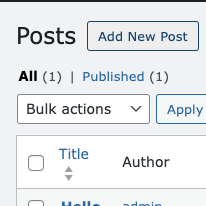</td>
		<td>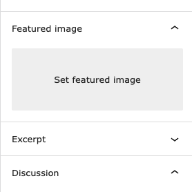</td>
	</tr>
</table>

## 5. Setting up the navigation

Menus are a very important aspect of your site; they should be consistent and easy to use for your visitors. This section of the tutorial will show you how to use the Menu Manager: a convenient tool that lets you customize your menus. In order to do this, you will need a few pages on your WordPress website. If you don't have multiple pages, that's fine, just create a few blank pages with different titles. That will work for our purposes.

### Basic usage

To access the Menu Manager from your Dashboard, simply make sure that the BCGov Block Theme is enabled (it will be if you've been following along) and click on "Menu Manager" in the left menu bar (see figure 5.1). You will see one item in a list called "Manage Site Navigation". Click here to start editing your menus.

The Menu Manager uses the Gutenberg Editor, the same editor that you used when editing pages and posts. Open the Document Overview bar on the left by clicking on the icon of the three slanted, horizontal lines in the top left area of the window (see figure 5.2). 

From the Document Overview, you should see a block named "Navigation". The arrow to the left should be facing down. If not, click on the right-facing arrow to make it point down and expand the contents of the Navigation block. Make sure the Navigation block is selected in the Document Overview and look to the right settings menu. Make sure the "Block" tab is selected, then look for text that says "Menu". Beside that text, click on the three dots and select the menu that you wish to edit (see figure 5.3).

For our purposes, you likely have not created a menu before, so the default "Navigation" menu should be selected. This menu, by default, contains a block called "Page List". The Page List block finds all of your pages and automatically adds them. You may find that all of your page links are present, and that you don't need to do anything else. However, if you wish to customize, there is much more that we can do. Let's explore.

### Creating a menu

Beyond the built-in Navigation menu, we can create our own. 

1. Make sure the Navigation block is selected in the Document Overview.
2. Look at the right settings bar. Make sure the "Block" tab is selected and click on the three dots beside Menu. This time, select the "Create new menu" option at the bottom. This will give you a fresh new menu with no items, and it will automatically be named with a name like "Navigation 2".

**Note: If "Create new menu" is disabled, try clicking on another block in the Document Overview, then select Navigation again.**

### Customizing a menu

When starting with a new menu, you should see a plus button in the editor (see figure 5.4). Click here to add a menu item. 

If you want to add a page, just search for the page name in the search box. Notice there are several other options near the bottom: Social Icons, Site Logo, Search, and Page List (see figure 5.5).

- **Social Icons**: Allows you to add social media to your menu. You will be able to customize the list of social networks.
- **Site Logo**: Add your site logo to the menu.
- **Search**: Add a search bar where users can search the contents of your site. Results will be displayed on a new page.
- **Page List**: As discussed previously, a list of pages on your site.

One more important option is to create a submenu. The submenu allows you to create a clickable category with items under it. For instance, say I wanted to create a section on my website called "About Us". When users click here, a drop-down menu with things like "our mission", "location", and "our team" would appear. These are all items that fit under the "About Us" category. The submenu button is located in the floating bar, in the main part of the Gutenberg editor (see figure 5.6).

After clicking on the submenu button, you can enter some text for your category, in my example: "About Us". Below that you'll see a new rectangle that's appeared. This is where you can add items to your submenu. Click where it says "Add link" and add a new link. Keep doing this, as needed, until your submenu has all of the items that you need.

<table>
	<tr>
		<th>Figure 5.1</th>
		<th>Figure 5.2</th>
		<th>Figure 5.3</th>
	</tr>
	<tr>
		<td>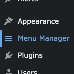</td>
		<td>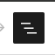</td>
		<td>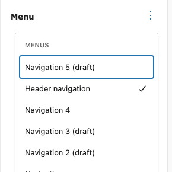</td>
	</tr>
	<tr>
		<th>Figure 5.4</th>
		<th>Figure 5.5</th>
		<th>Figure 5.6</th>
	</tr>
	<tr>
		<td>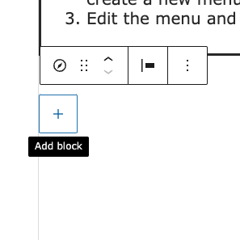</td>
		<td>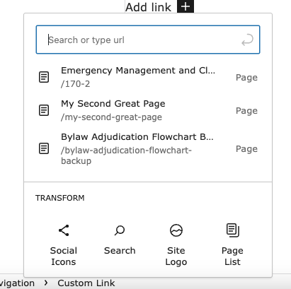</td>
		<td>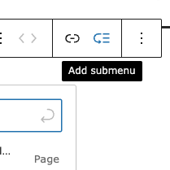</td>
	</tr>
</table>

## 6. Changing the appearance of your site

Check out this tutorial for information about setting up the styling on your site: [Using Alpha 3 Styling](./using-alpha-3-styling.md).
