# Using Alpha 3 Styling

Welcome to this tutorial on using BC Design System Alpha 3 Styling with the Block Theme. The goal of this tutorial is to update your site so that it has a crisp and modern look that is in-line with the British Columbia Government's Alpha 3 Design System. We can break this down into three main steps: changing default styles, setting up the header and footer, and utilising patterns.

But first of all, what is the BC Design System, what is Alpha 3, and why is it important to your site?

## The BC Design System and Alpha 3

### Summary

From the B.C. Design System documentation:

> The B.C. Design System will give design and software development teams the building blocks to deliver intuitive, accessible digital services.

> The new design system will replace the legacy design system. Legacy component and documentation will be deprecated and archived.

And from the common components design system website:

> Ministries developing or revising digital services and web pages must consider design features that affect the look and accessibility of their products.

> The BC Government Design System for digital services promotes consistency and helps make your online service easy to understand and use. It provides a range of consistent user interface elements. These elements can be easily incorporated into online services. They include buttons, form fields, and navigation bars. Page designers can easily plug these elements into their work.

> Design System guidelines also offer detailed specifications for design choices such as fonts, colours, links and selection buttons. They also provide invaluable guidance on issues such as types of browsers, devices and operating systems your online service must accommodate.

The latest iteration of the BC Design System is Alpha 3. From the Alpha Gov website:

> Today, more and more people access the website using a mobile device. Just four years ago, only 20% of visitors to gov.bc.ca were mobile users. In 2021, over 50% of visitors to the website used a mobile device, and we expect the upward trend to continue. Especially over the past several years, its become increasingly important for people to easily locate clear and up-to-date information on the government’s website.

> Based on our research and the latest best practices, the new design is less cluttered, with information better organized for end users. In addition, it features a strong vertical layout, optimized for mobile.

**Note: Alpha 3 is a working name and may change in the future.**

### Examples

Let's take a look at some Alpha 3 Design System examples before we jump into the tutorial.

**Header**

 
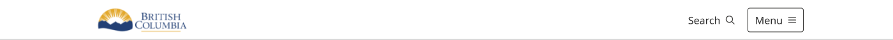

**Banner**

 

**Heading 1**

 

**Heading 2**

 

**Other Content**

 
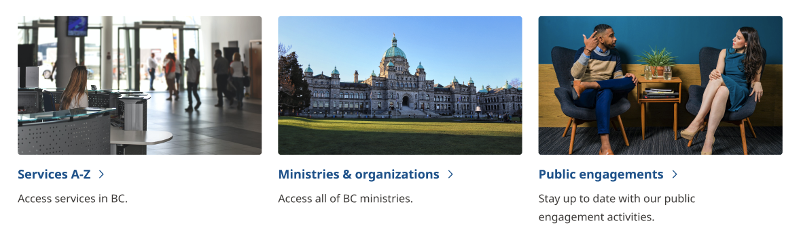
&nbsp;
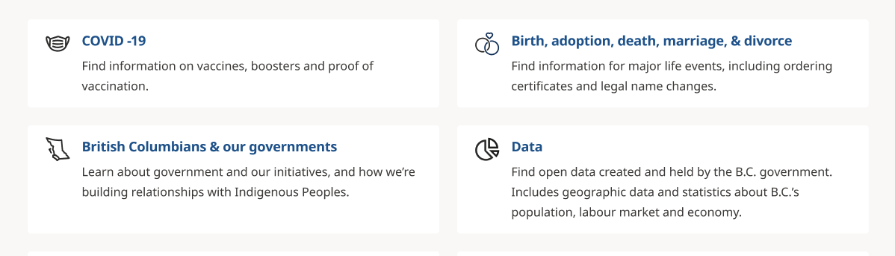
 
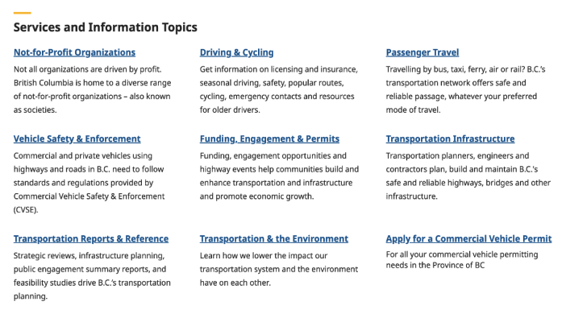
&nbsp;
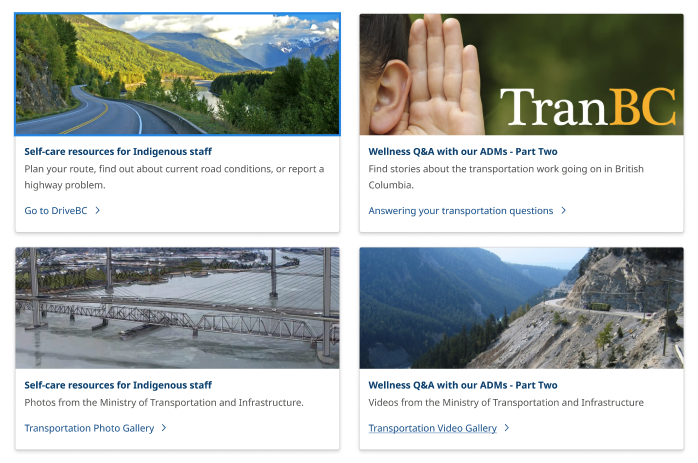

**Footer**

 
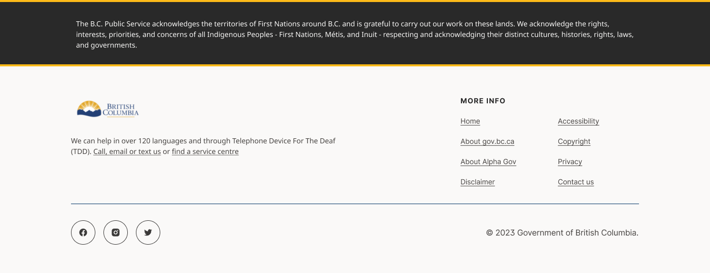
 

## 1. Changing Default Styles

First, let's change the default styles. The styles affect the default typography, colors, and layout on your website. We've done the hard work of aligning the styles with the Design System. All you have to do is follow these instructions to enable it.

1.	In your WordPress dashboard, go to Appearance > Editor (see figure 1.1).
2.	In the Editor, select "Styles" from the list on the left (see figure 1.2).
3.	You will see a list of boxes with letters and colour swatches. Pick "Alpha V3" from the list (see figure 1.3).

<table>
	<tr>
		<th>Figure 1.1</th>
		<th>Figure 1.2</th>
		<th>Figure 1.3</th>
	</tr>
	<tr>
		<td>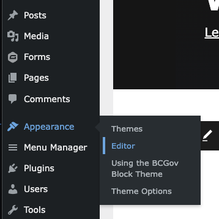</td>
		<td>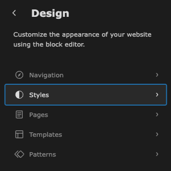</td>
		<td>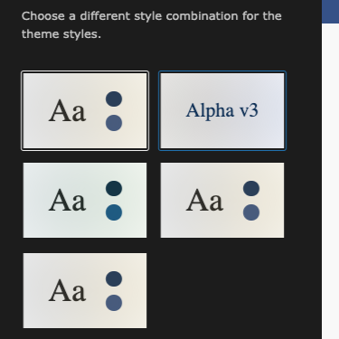</td>
	</tr>
</table>

When you make this selection, you may notice that the styles have changed in the preview window on the right. But there's still a lot of blue, so we have work to do.

## 2. Setting Up the Header/Footer

Now it's time to update the header and footer. We have created a header and footer that match the specifications of the Alpha 3 Design System. All you need to do is update your global header and footer containers so that they use the new template parts. After this is done, all of your pages will use the updated header and footer automatically.

### Setting the Header

 

 

1.	In your WordPress dashboard, go to Appearance > Editor (see figure 2.1).
2.	In the Editor, go to Patterns. There is a section labeled "Template Parts" on the left. Below it, click on "Header" (see figure 2.2).
3.	Select the Global Header Container. You will see info on the left about the template part, and the header design on the right (see figure 2.3).
4.	Click on the header to begin editing.
5.  Open the List View by clicking on the button in the top left that looks like three stacked lines that are slightly offset (see figure 2.4).
6.  In the List View, open the item named "Group" by clicking on the right-facing arrow beside it (see figure 2.5).
7.  You will have two items here, "Accessibility Skip Nav" and "General Header with ribbon nav".
8.  Go down to "General Header with ribbon nav", press on the three dots beside it and select "Replace General Header with ri..." (see figure 2.6).
9.  A new window will open with several template parts. Select "Alpha v3 Header with ribbon nav and search".
10. Click on the Save button in the top right of the window.

<table>
	<tr>
		<th>Figure 2.1</th>
		<th>Figure 2.2</th>
		<th>Figure 2.3</th>
	</tr>
	<tr>
		<td></td>
		<td>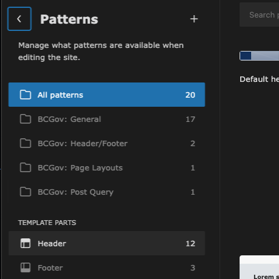</td>
		<td>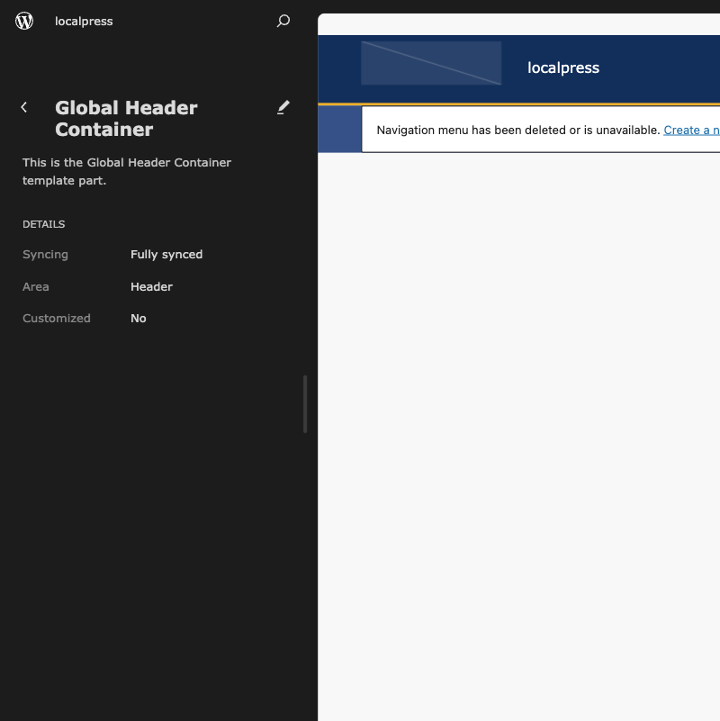</td>
	</tr>
	<tr>
		<th>Figure 2.4</th>
		<th>Figure 2.5</th>
		<th>Figure 2.6</th>
	</tr>
	<tr>
		<td>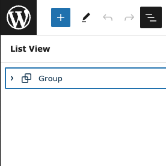</td>
		<td>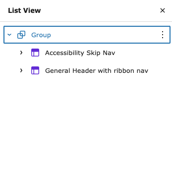</td>
		<td>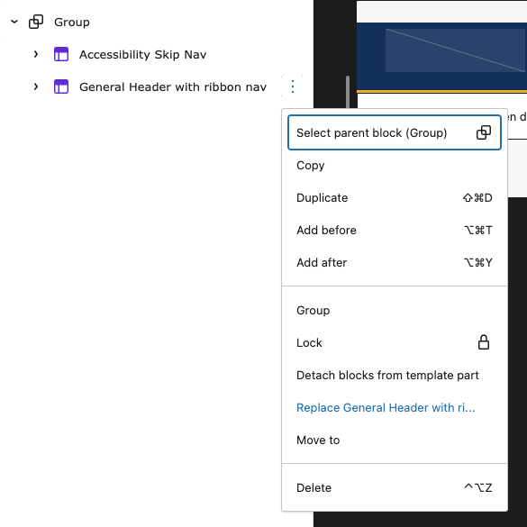</td>
	</tr>
</table>

### Setting the Footer

 

 

1.	In your WordPress dashboard, go to Appearance > Editor (see figure 2.7).
2.	In the Editor, go to Patterns. There is a section labeled "Template Parts" on the left. Below it, click on "Footer" (see figure 2.8).
3.	Select the Global Footer Container. You will see info on the left about the template part, and the actual footer on the right (see figure 2.9). 
4.	Click on the footer to begin editing.
5.  Open the List View by clicking on the button in the top left that looks like three stacked lines that are slightly offset (see figure 2.10).
6.  In the List View, open the item named "Group" by clicking on the right-facing arrow beside it (see figure 2.11).
7.  You will have one item here, "BCGov Footer". Press on the three dots beside it and select "Replace BCGov Footer" (see figure 2.12).
8.  A new window will open with several template parts. Select "Alpha v3 Footer".
9.  Click on the Save button in the top right of the window.

<table>
	<tr>
		<th>Figure 2.7</th>
		<th>Figure 2.8</th>
		<th>Figure 2.9</th>
	</tr>
	<tr>
		<td></td>
		<td>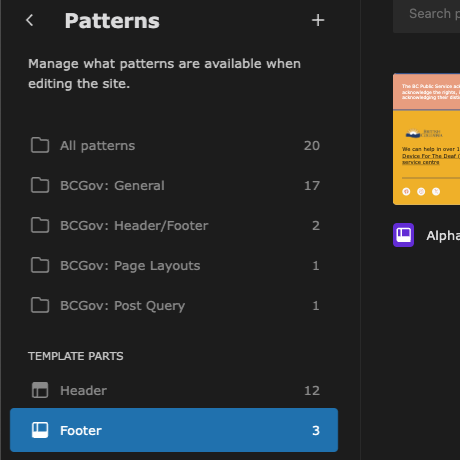</td>
		<td>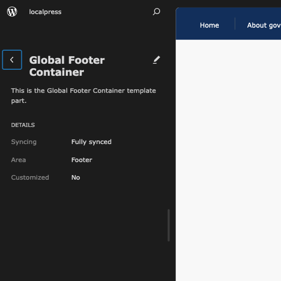</td>
	</tr>
	<tr>
		<th>Figure 2.10</th>
		<th>Figure 2.11</th>
		<th>Figure 2.12</th>
	</tr>
	<tr>
		<td></td>
		<td>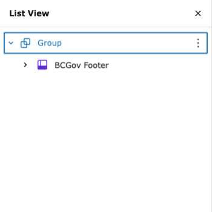</td>
		<td>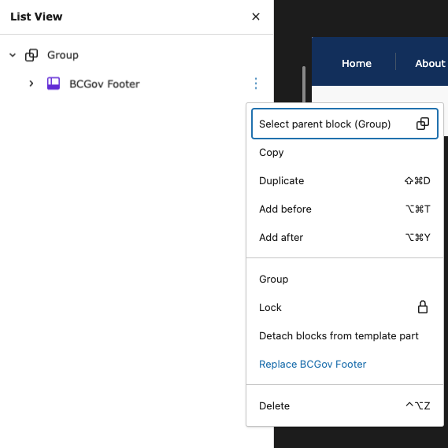</td>
	</tr>
</table>

## 3. Adding Patterns to a Page

### Using Patterns in the Editor

Now that you've set up your styles, header, and footer, the last step is to incorporate Alpha 3 patterns into your pages. Let's take a look at how this is done.

1.  From the Dashboard, go to Pages (see figure 3.1).
2.  Either go to an existing page and press "Edit" (see figure 3.2) or click on the "Add New Page" button at the top of the window (see figure 3.1).
3.  You're now in the Gutenberg Editor. Hover over the section where you wish to add content and click on the plus button (see figure 3.3).
4.  Press the "Browse all" button. This will open a new section on the left side of the screen (see figure 3.3).
5.  At the top, switch the tab to "Patterns".
6.  You will see several options in the Patterns list. Select "BCGov: Alpha v3" to see the patterns specific to the Alpha v3 Design System.
7.  Select a pattern to place it in your content. You can replace the default images, text, and other content with your own.

<table>
	<tr>
		<th>Figure 3.1</th>
		<th>Figure 3.2</th>
		<th>Figure 3.3</th>
	</tr>
	<tr>
		<td>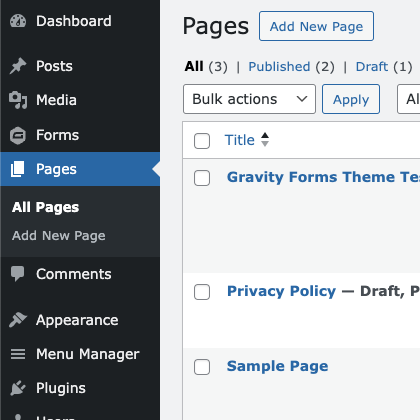</td>
		<td>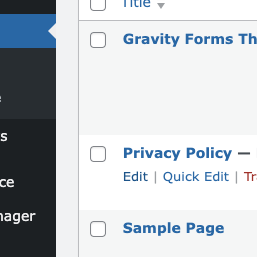</td>
		<td>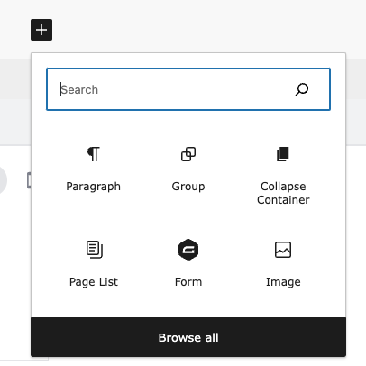</td>
	</tr>
</table>

### General Content Tips

-  The title of the page (H1) will automatically be formatted to fit the Alpha 3 theme
-  For Alpha 3 H2 headings, please select the pattern using the method above
-  Always create content that is accessible and easy to read
-  Keep headings and content left-aligned whenever possible
-  Keep your List View open in the Gutenberg Editor so you can see the structure of your blocks

 

&nbsp;

 

&nbsp;

 
