# Using Custom Post Types

Welcome to this tutorial on using custom post types with the Block Theme. The goal of this tutorial is to show you how to setup and use a custom post type from your WordPress dashboard. But before we get into that, let's talk about custom post types and why they're useful.

## What are custom post types?

### Introduction

A custom post type is used when the regular WordPress posting system is not suitable for a task. The regular WordPress posting system allows you to create news/blog posts and organize/manage them from the WordPress Dashboard. On the public side of your website, these posts can then be displayed to the user as a feed. This functionality is ideal for simple scenarios where you wish to keep users up to date. However, maybe you require an events calendar that sorts by event date, or a product catalogue. Perhaps you would like to use the regular posting system for news/blog updates but need a different post type for a different purpose. This is when custom post types become useful.

### Custom Post Type UI

The Custom Post Type UI plugin is one of the required plugins for the Block Theme. This is a hint that it's very important. It allows us to create and modify custom post types, and it gives us a long list of options for them. It allows us to:

* Create, edit, and delete custom post types
* Control which features are available for the post type
* Change how the post type title appears in fields and menus
* Control several advanced settings that are beyond the scope of this tutorial

In addition to creating and managing custom post types, you can also create and manage taxonomies with the Custom Post Type UI. We will discuss this in a separate tutorial - let's stick to custom post types for now.

## Making and using a custom post type

### 1. The Scenario

For the purposes of this tutorial, we will pretend that we are creating an environmental protection website. On this website, we need a regular news feed to inform the public of our progress and a separate alert feed with important updates about environmental disasters and missing animals. The alert feed will show up higher on the homepage, with bold colours that inform the page visitor of its importance.

Note: The block theme includes a banner feature that can be used to show a single alert as a banner at the top of your homepage. However, if you wish to show multiple alerts at once, this method would be a good solution.

### 2. Creating the post type

From your WordPress Dashboard, go to Plugins. You should see "Custom Post Type UI" in the list of available plugins (see figure 2.1). Enable it if it's currently disabled, then head back to your dashboard.

Select "CPT UI" in the Dashboard menu on the left side of the screen. This will start the creation of a custom post type (see figure 2.2). Let's go over the different fields and how to fill them out.

* **Post Type Slug**: This is the name of your custom post type as it will be used in URLs. It can only container lowercase letters, numbers, dashes, and underscores. Example: "alert"
* **Plural Label**: How your post type is displayed in a plural context. Example: "Alerts"
* **Singular Label**: How your post type is displayed in a singular context. Example: "Alert"
* You can ignore "Auto-populate labels" and the migration feature that are directly below the first three fields

Now you can scroll down to the bottom of the page. We are particularly interested in the "Supports" section (see figure 2.3). Here we can decide which features are supported for this post type. By default, it will select Title, Editor, and Featured Image. As you can see, there are several more options available. If you want users to comment on a specific alert post, you could enable that feature. If you want to share the author of the post, you could check that item as well.

Below that section you'll also see a Taxonomy section (see figure 2.3). Here you can decide which taxonomies are relevant to this post type. We'll cover that in a different tutorial. For now, click on "Add Post Type". You should see a new item in your left menu bar that says "Alerts".

<table>
	<tr>
		<th>Figure 2.1</th>
		<th>Figure 2.2</th>
		<th>Figure 2.3</th>
	</tr>
	<tr>
		<td>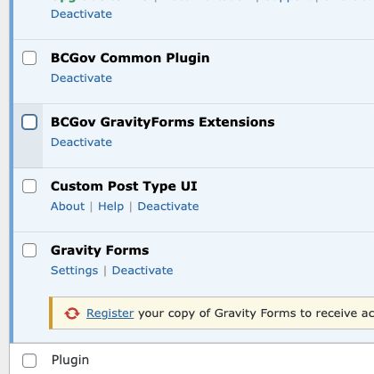</td>
		<td>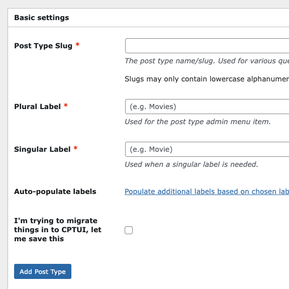</td>
		<td>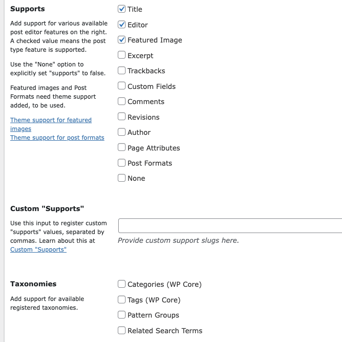</td>
	</tr>
</table>

### 3. Making posts

We've created the ability to make alert posts for our environmental protection website. Now let's make an actual alert post so we can warn our users about a growing forest fire.

1. Go to "Alerts" from your WordPress Dashboard. It should have an icon of a thumbtack beside it (see figure 3.1).
2. Click on the "Add New Post" button at the top of the window (see figure 3.2).
3. You are now in the Gutenberg editor, the main WordPress editor suite.
4. Enter a title for your post where it says "add title" (see figure 3.3). Example: "WARNING: Growing forest fire in Kootenay region"
5. Below the title, you will see some text that says "Type / to choose a block". Click here and you can write the body/content of your post (see figure 3.3).
	- Example: "There is a forest fire growing in the Southern Kootenay region of British Columbia. If you live here, please gather essentials in case of an evacuation alert."
	- **Note: You can add more complex formatting with blocks and patterns in this section if needed. For our uses, we just need to use the default paragraph block that's placed here.**
6. On the right side of the screen, you should see the settings bar. At the top, you should see two tabs for "Alert" and "Block" (see figure 3.4). Make sure that "Alert" is selected.

**Note: Steps 7 through 9 are optional. They will explain how to add an image to your post.**

7. Go down to "Featured image" and expand the section if it's closed. Then, go to "Set featured image" (see figure 3.5).
8. This will open the Media Library. This may be empty. You can select the "Upload files" tab to select an image from your local drive.
9. Click on the "Set featured image" button.

10. Now you can click on the "Publish" button in the top right of the screen to publish your Alert post (see figure 3.6).

<table>
	<tr>
		<th>Figure 3.1</th>
		<th>Figure 3.2</th>
		<th>Figure 3.3</th>
	</tr>
	<tr>
		<td>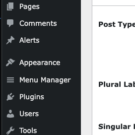</td>
		<td>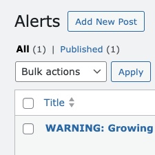</td>
		<td>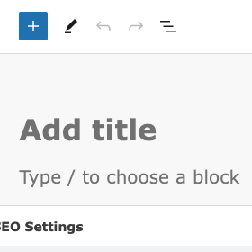</td>
	</tr>
	<tr>
		<th>Figure 3.4</th>
		<th>Figure 3.5</th>
		<th>Figure 3.6</th>
	</tr>
	<tr>
		<td>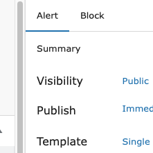</td>
		<td>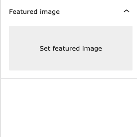</td>
		<td>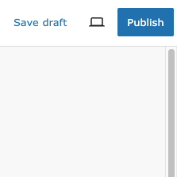</td>
	</tr>
</table>

Congratulations, you've created your important alert. But now we need to find a way to show this to the public. We'll tackle that next.

**Note: Every time you create a new post, WordPress will create a special page just for that post. The Block Theme has default styling for posts, but you can use custom blocks and patterns in your post if you wish to control how your individual post pages look. You do not need to link to these individual post pages on your website, and they can be hidden from searches.**

### 4. Using the Query Loop

The Query Loop is a Gutenberg Block that can be utilized from the Gutenberg Editor - that's the editor that we used to create our post. We can also create the main pages of our site with the Gutenberg Editor. For this section of the tutorial, let's edit our homepage so that it displays our alerts at the top with a bright red background and white text.

Navigate from the WordPress Dashboard to "Pages" in the left navigation bar. From Pages, click on the "Add New Page" button at the top of the screen. Where it says "Add Title", we'll enter "Home". Now, in the body of the page, we'll select a pattern. Click on the square with a plus symbol inside of it and go to "Browse All" (see figure 4.1). 

A new menu bar will appear on the left side of the window. We're searching for a pattern to get us started, so let's select the "Patterns" tab. From there, go to the "BCGov: Page Layouts" category and select the item with a BC Ferry in the background (see figure 4.2). This will act as a basic layout for our page.

**Note: If the layout looks too narrow in the editor, try going to the Settings bar on the right side of the page, switch to the "Page" tab, click on "Pages" beside "Template" and then change the value to "Page - Content only" (see figure 4.3). This should give you a full-width container to work with.**

Great, we have a good starting point. Now let's load the query block and display our alert post. Here are the steps:

1. Open the Document Overview bar by clicking on the icon that looks like a slanted hamburger in the top left of the screen (see figure 4.4).
2. In the Document Overview bar, select "Cover" and press the ENTER key. This should create a new block right underneath the cover image. Click on the button with the plus symbol and select "Browse All" again.
3. We're searching for a block this time. Enter "query loop" in the search field to reveal the Query Loop block. It has a symbol that looks like a sideways figure 8 (see figure 4.5).
4. Select the block to place it in your page. You should see two options within the Query Loop block, "Choose" and "Start Blank" (see figure 4.6).
5. Click on "Start Blank" and then select "Date, Title, & Excerpt".

**Note: Please make sure that your left Document Overview bar is open for the following steps. It will make the process much easier. If it's closed, you can open it again by clicking on the icon of the tilted hamburger near the top left of your screen (see figure 4.4).**

6. In the Document Overview bar, let's open up the Query Loop by clicking on the arrow beside it, and then we'll do the same to the Post Template block within it. This will show us the full contents of the Query Loop (see figure 4.7).
7. From the Document Overview bar, select the Pagination block, click the three dots at the right of it, and select "Delete". 
8. Do the same with the "No results" block (delete it).

**Note: Because we are using this query type as an alert system, we will likely not have many results. For this reason, I removed the Pagination and No Results blocks. For your own query loop, you may want to keep the Pagination and No Results blocks.**

9. Select the Query Loop block in the Document Overview bar.
10. In the right Settings bar, make sure the "Block" tab is selected and scroll down to "Post Type". Switch the value from "Post" to "Alert" (see figure 4.8).
11. In the main Gutenberg editor where your page content is, there is a floating toolbar above the Query Loop. You should see an icon that has three horizontal lines: a thin one, a thick one, and another thin one. Click on this icon and select "Full Width" (see figure 4.9). This will make our layout wider.
12. Back in the left Document Overview bar, let's look at the contents of "Post Template" by clicking on the arrow beside it (if it's not already expanded).
13. Select "Excerpt". Now look to the floating toolbar in the middle of the page. There should be an icon that has a quotation mark and two horizontal lines under it (see figure 4.10). Click on this icon and select "Content". This switches the Excerpt bock to a Content block.
14. Back in the Document Overview bar, select "Title". Click on the three dots to the right of it and select "add before" from the list.
15. This will create a paragraph block. Click the plus button beside it and type "group". This should filter the block list down to the Group block (see figure 4.11). Select this block.
16. The Group block will ask you to select a layout. Choose the single rectangle as opposed to the dual vertical/horizontal rectangles (see figure 4.12).
17. Back in the Document Overview bar, you should see the Group block above Title, Date, and Content. While holding your SHIFT key, select Title, select Date, and select Content. All three should be highlighted (see figure 4.13). Now click and drag them to the Group block. This will place the Title, Date, and Content blocks inside the Group block. You can think of the Group block as a container that holds the post content.
18. We're almost there! Now we just need to make everything look pretty. Select the group block in the left Document Overview bar. In the right Settings bar, enable the toggle labeled "Inner blocks use content width". Underneath, where it says "Content", enter a value of "1440" (see figure 4.14).
19. In the same right settings bar, click on the tab that looks like a circle split into two sides: black and white (see figure 4.15). This is the styles tab.
20. Under "Color", go to "Background". This brings up a colour picker. Select bright red. Still under "Color", select "Text" and choose the colour white from the picker.
21. Last step! In the left Document Overview bar, select the Title block. In the right Settings bar, switch to the styles tab. Change the text colour to white here, just like you did before.

You did it! We have created a query loop to display our alert posts near the top of our page. Press the "Update" or "Publish" button in the top right of your screen to save your work. You can then press the icon that looks like a square with an arrow pointing to the top right. It's in the top right of your screen. This will allow you to view the public page (see figure 4.16).

<table>
	<tr>
		<th>Figure 4.1</th>
		<th>Figure 4.2</th>
		<th>Figure 4.3</th>
	</tr>
	<tr>
		<td>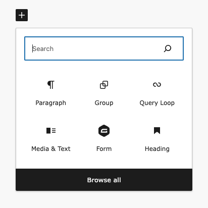</td>
		<td>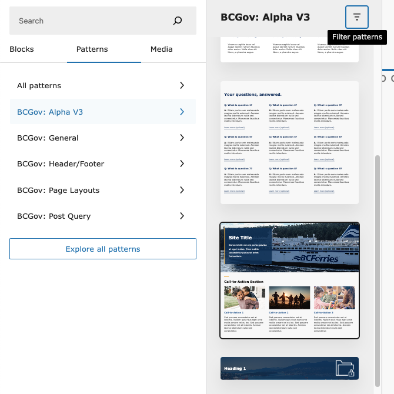</td>
		<td>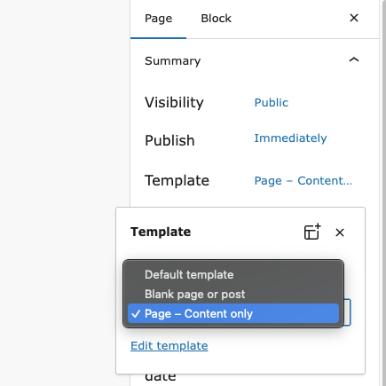</td>
	</tr>
	<tr>
		<th>Figure 4.4</th>
		<th>Figure 4.5</th>
		<th>Figure 4.6</th>
	</tr>
	<tr>
		<td>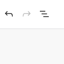</td>
		<td>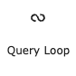</td>
		<td>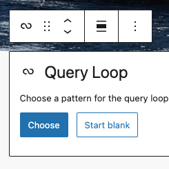</td>
	</tr>
	<tr>
		<th>Figure 4.7</th>
		<th>Figure 4.8</th>
		<th>Figure 4.9</th>
	</tr>
	<tr>
		<td>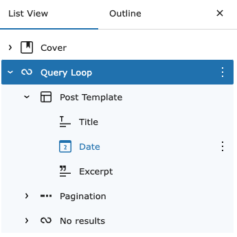</td>
		<td>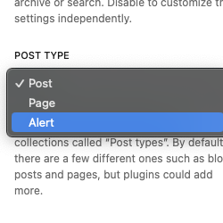</td>
		<td>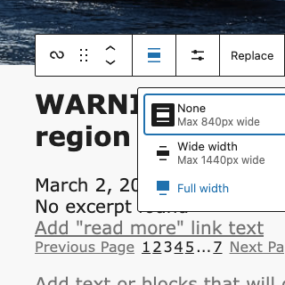</td>
	</tr>
	<tr>
		<th>Figure 4.10</th>
		<th>Figure 4.11</th>
		<th>Figure 4.12</th>
	</tr>
	<tr>
		<td>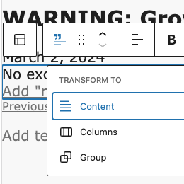</td>
		<td>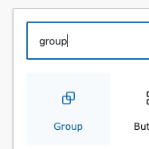</td>
		<td>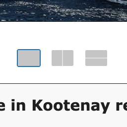</td>
	</tr>
	<tr>
		<th>Figure 4.13</th>
		<th>Figure 4.14</th>
		<th>Figure 4.15</th>
	</tr>
	<tr>
		<td>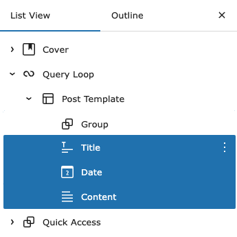</td>
		<td>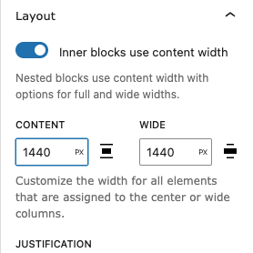</td>
		<td>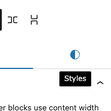</td>
	</tr>
</table>
 
<strong>Figure 4.16</strong>
 
 
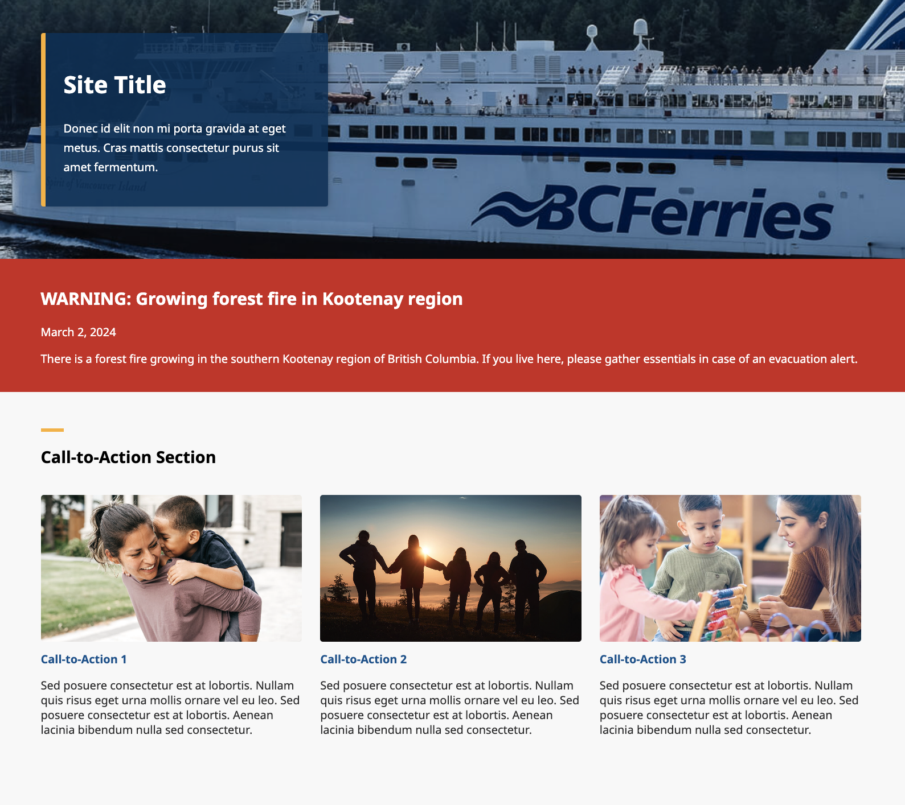
 

