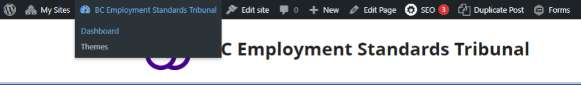
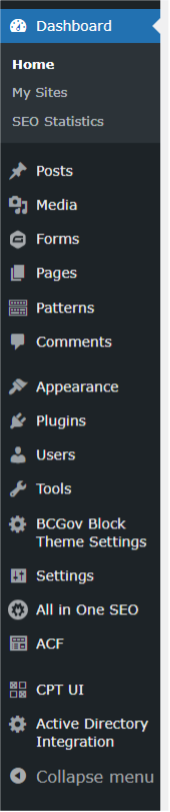
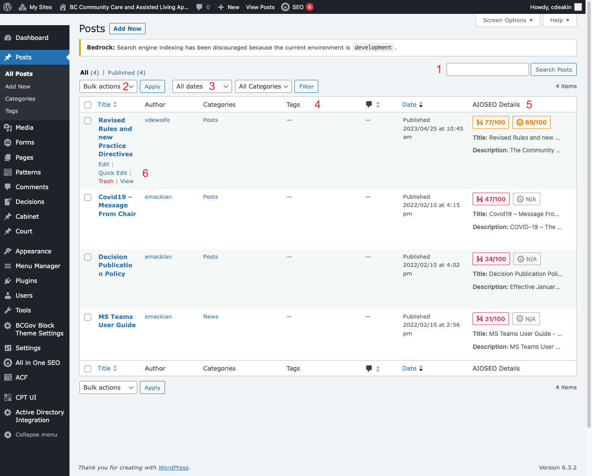
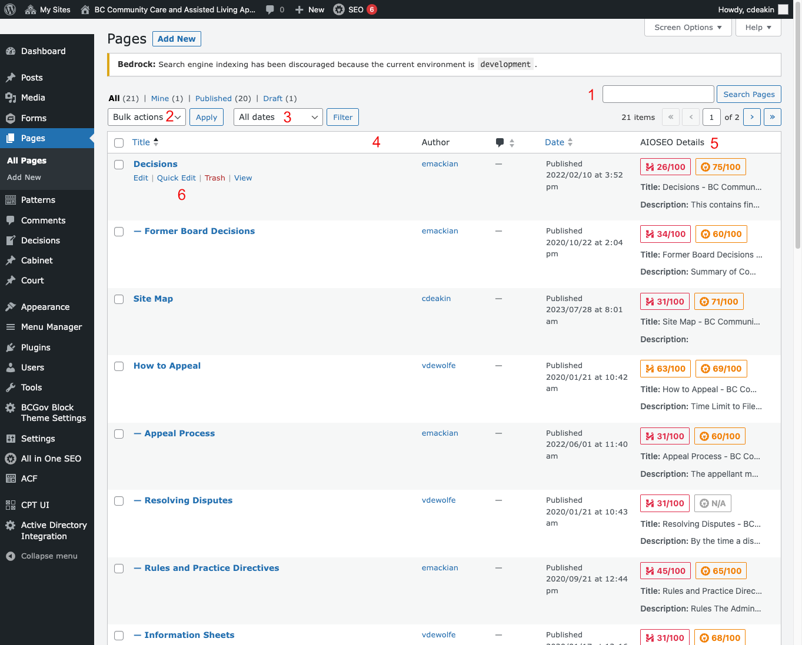
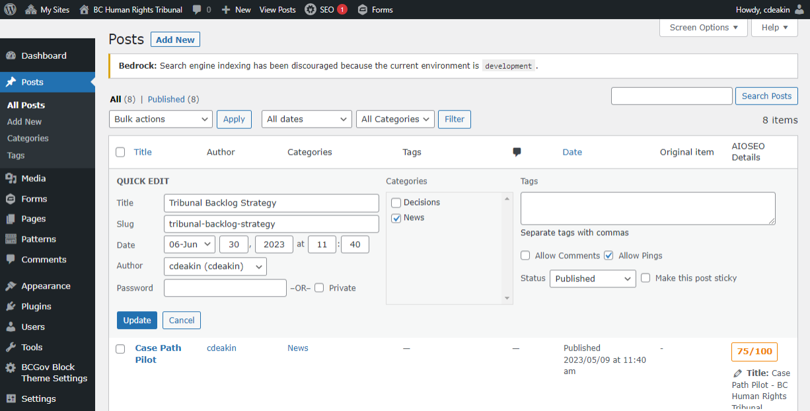

# Admin Screens

## Top Admin Bar

Key Navigation / Shortcut Icons

After logging in to the site, the initial main menu is visible.
- **My Sites** – drop menu to other sites you may have access to.
- Access the **dashboard** from the site title drop down menu.
- **Edit Site**
  - Quick access to the site and block templates and CSS styling. Advanced use only.
- **New** – quick create option for content types available on your site.
- **Edit Page**
  - Quick access to edit the content of the page you’re currently viewing.

## Admin Sidebar

**Dashboard** – Displays an overview of site health, content changes, etc. Info boxes can be arranged to your liking.

**Posts** – These are used to create news releases with the 3 or 4 most recent showing on the front page. May also display categories and tags that can be attached to the posts.

**Media** – Images, supporting docs, media files. Uploaded here and inserted into your content.

**Forms** – This is a specific plug-in used to create custom contact forms. It maybe installed but has to be activated for use.

**Pages** – Create new content pages and edit existing pages. 

**Patterns** – Patterns are elements of a page, or a complete page. New content can be created using these patterns to save time redoing everything. Changes made to patterns do not update content based on the pattern.

**Comments** – Administer comments made within your site.

**Appearance** – Change themes, access the template editor, information on the BCGov Block Theme and theme options.

**Plugins** – Plugins can be added to enhance functionality. Plugins can be activated but must be done with extreme caution. 

**Users** – Administer users and permissions.

**Tools** – Site admin tools.

**BCGov Block Theme Settings** – Advanced setting for the block theme.

**Settings** – Initial settings for the site. After the site setup, these settings should be only be changed in rare situations.

**All in One SEO** – Provides real-time SEO feedback. Basic version installed.

**ACF** – Plugin to create custom fields for use in custom content types like decisions.

**CPT UI** – Plugin to create custom content types like decisions.

**Active Directory Integration** 

## Post/Page Screens

To view all the Posts in your site:
- Log in to your WordPress admin screen.
- Click Posts in the left sidebar. This will show the Posts screen with a list of all the pages you have in your site.
 

1. Search for content based on the Post Title.
2. Perform Bulk actions > Edit or Move to Trash by selecting multiple Posts/Pages from the list.
3. Filter content based on dates.
4. Sort the content list based on Title, Date, Author etc by clicking the Header columns.
5. Realtime SEO tips for title and description.
6. Quick edit - Update title, slug, publish date, parent page, template and publish status.

An example of the quick edit options screen.

