# Templates

> A template controls the layout of your pages. Not to be confused with Themes (that set the design of your entire site), the template affects the look and feel of an individual page (or post) or groups of pages (or posts.)

Individual pages can be set to use a specific **Page Template** created within your theme. You can also create custom Page Templates that can be used for a page. These custom Page Templates will then override the default Page Template included with your Theme.

**Dashboard menu – Appearance – Editor**

Editing or creating new page templates requires an understanding of content, content fields and page layout options such as columns, div tags, etc.

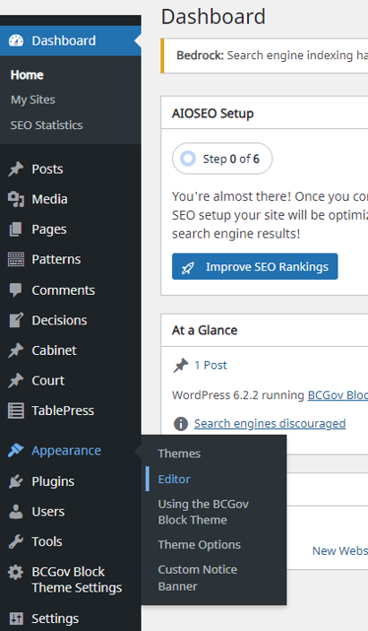

In the side image example shown here, the Decisions, Cabinet and Court pages are custom content types which also contain custom content fields. These are handled with the CPT UI and ACF plugins.

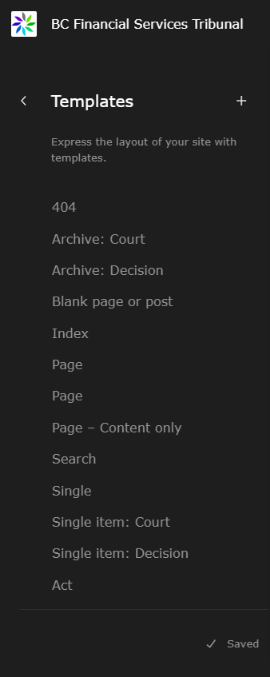

The page template menu screen shown above, shows custom templates made for Archive: Court, Archive: Decision, Single Item: Court and Single Item: Decision.
The template controls how the page is displayed.

The template controls how the page is displayed.
You can identify the template a page is using by following these steps:

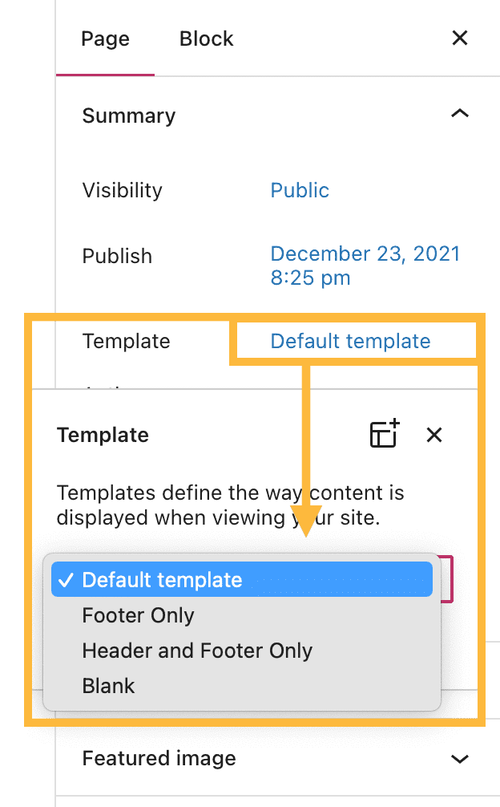

1.	In your WordPress dashboard, click Pages.
2.	Click a page’s name to open that page in the editor.
3.	In the Page settings on the right, under Summary, locate the Template option.
4.	Note the name of the template the page is using.

If you do not see the sidebar on the right, click the Settings icon in the top right corner to bring up the settings. This icon looks like a square with two uneven columns:

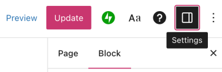

Changing a page’s template to a different template affects that page only (not your entire site.)
Common Types of Templates
Before getting into how to edit templates, let’s cover the common templates you are likely to encounter. A few base templates are included automatically when you select a theme. WordPress uses these templates to create default styles for specific page types.

The most common templates are listed below:

- **Home template** – used for the default homepage of your site.
- **Index template** – when a Home template is absent, some themes will use the index template as the default home page. Otherwise, it is used to display your latest posts.
- **Page template**– controls the layout of standard pages of your site, such as an About or Contact page. Some themes also use the Page template to display the home page.
- **Single template** – this template styles your individual blog posts.
- **Archive templat**e – is the design for category pages, tag pages, and other archive pages.

Depending on your site’s active theme, your site may have some or all of the templates mentioned above. You can check which templates are included with your theme by following these steps:

1.	Visit your dashboard.
2.	Navigate to Appearance → Editor.
3.	Click Templates.
4.	Click Manage all templates to see a full list of your site’s templates with descriptions of their purpose.

## Edit a Template

By now, you may be used to editing your content using the WordPress page & post editor. Taking this further, you may switch to the Template Editor to edit the overall layout of pages and posts, including the header elements (such as the site title and tagline), the footer, and how the content is presented within the page or post.
Here’s how to edit a template.

### Step 1: Choose a Template

Your theme includes a set of templates that you can edit. To edit a template included with your theme, follow these steps:
1.	Visit your dashboard.
2.	Go to Appearance → Editor.
3.	Click Templates.
4.	Click the name of the template you wish to edit.
5.	Click the pencil icon to open up the editing interface.

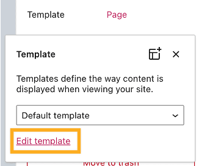

You can also access the template editor when editing an individual page or post:

1.	In the Page Editor, click on Template under Page Settings, as shown on the right.
2.	Click Edit Template to open the template editor.

Edits you make to the template will apply to all pages that use the template.
Once you’re done with your edits, click the back arrow in the top left to return to the page you were working on. When you publish the page, you’ll be prompted to save the changes you made to the template as well.

### Step 2: View The Structure of Your Template

In the template editing screen, you will see the name of the template you’re editing (1), and under Settings, you’ll see “Template”(2):

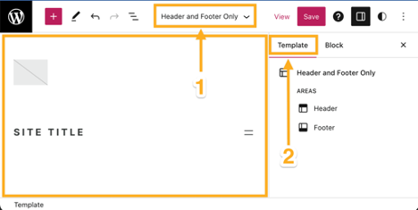

To see a list of all the blocks in your template, click on List View at the top left of the screen (the icon looks like three horizontal lines.) List View is useful for seeing the overall structure of your template before you start editing specific sections. You can then click on any block in the List View to move, remove, or change that block’s settings:

List View in the **Template Editor**

### Step 3: Edit the Template Blocks

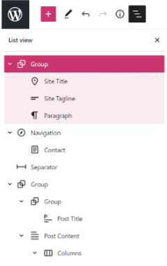

In the **Template Editor**, click on any block to adjust the content or change the block settings. Some of the actions you can take here include:

- Edit the header elements such as the Site Title block, Site Tagline block, and Site Logo block. Visit Customize Your Header to learn more.
- Add or edit your menu using the Navigation block.
- Add a sidebar using columns.
- Control the appearance of your posts.
- Hide page or post titles.
- Edit the appearance of your footer.

### Step 4: Save Your Changes

When you’re finished making edits, click Save in the upper right corner.
The affected template will be shown here. Click Save again to confirm you wish to save the changes made to that template.

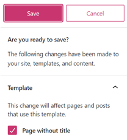

## Create a New Template

You can design a new template and apply that template to specific pages or posts. Follow these steps to create a new template:

**From the Site Editor**

1.	Visit your dashboard.
2.	Navigate to Appearance → Editor to open the Site Editor.
3.	Click Templates.
4.	Click the + icon to add a new template.
5.	Select one of the built-in options or create your own template using the Custom template option at the bottom.
6.	Give your template a name and click Create.
7.	Choose an existing pattern or click Skip to start with a blank template.
8.	Click the + block inserter icon to insert any blocks or patterns you wish to have in your template.
    - Make sure to include a Post Content block so that the template will include the page/post content.
9.	Once you have finalized your design, click Save to make your template available on the site.

From the Page Editor
If you’re working on an individual piece of content like a page or post, you can create a new template following these steps:
1. In the Page settings in the right sidebar, click the template name, then click the Add template icon as shown on the right.
2. Give your new template a descriptive name, such as “Post with sidebar”, and click **Create**
3. In the **Template Editor**, you can now edit the structure in which your page is displayed.
   - Make sure to include a Post Content block so that the template will include the page/post content.
4.	When you’re done, click **Publish** or **Update** in the top right corner to save your new template.
5.	Click **Back** to return to the page/post editor, where your newly-created template is now in the list of available templates.

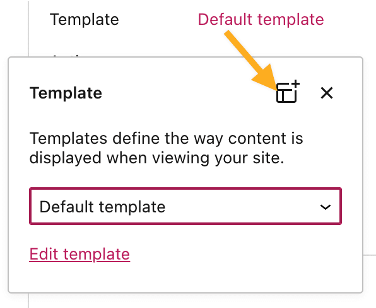

## Apply a Template

Once you have customized a template or created a new one, you can apply it to a specific page or post using the following steps:

1.	Visit your dashboard.
2.	Click on Pages or Posts and select the page/post you want to apply the template to.
3.	In the **Settings** sidebar on the right, locate the **Template** section.
o	If you don’t see the Settings sidebar, click the settings icon next to **Publish** or **Update** to open your Settings sidebar.
4.	Choose the template you want to apply.
5.	Preview how the page or post will look with the template applied. Click the **Preview** option at the top of the editor, and select **Preview in new tab**.
6.	Once you’re satisfied with the template and the content of the page/post, click Publish. Or, if the page/post was already published, click **Update** to apply your changes to the published page.

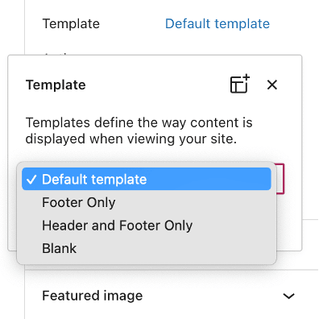

## Default Templates

Some templates are applied automatically and can’t be applied to a regular page.

For example, the **Archives template** is automatically applied to category pages and other archive pages. The **Home template** is automatically applied to the custom home page, and the **Index template** is applied to your latest posts page.

## Reset a Template

To restore a template to its default state, undoing all edits you made, follow these steps:
1.	Visit your dashboard.
2.	Navigate to Appearance → Editor.
3.	Click **Templates**.
4.	Scroll down and click **Manage all templates**. Any modified templates are labeled with Customized.
5.	Click the three dots next to the template you wish to reset
6.	Select **Clear customizations**. The changes will immediately be reverted to the default layout. This change cannot be undone.

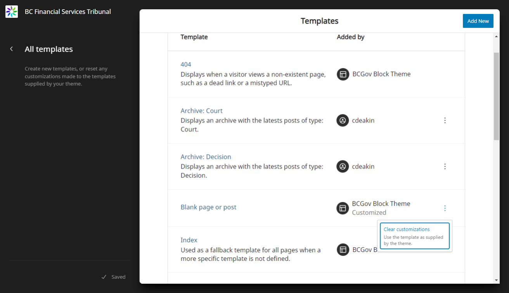

