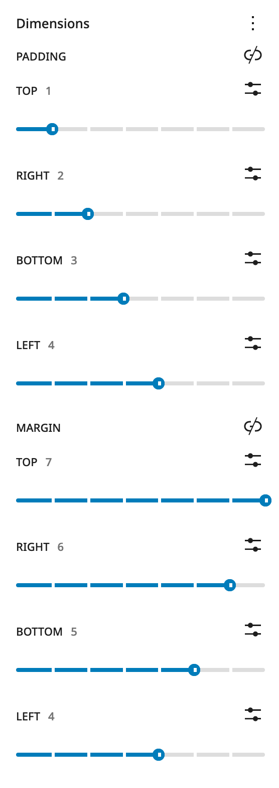
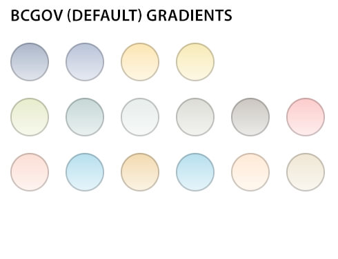
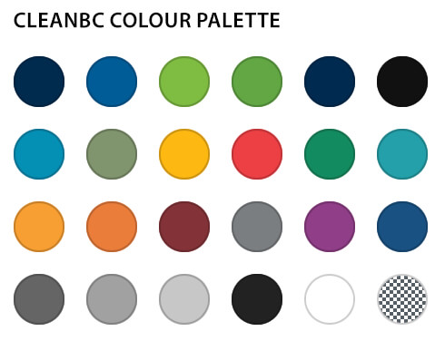

# Theme Settings

The BCGov Block Theme allows you to change some of the behaviours of the site such as theme styles and how the header behaves. These are coupled with the Block Theme Appearance settings. Simply go to the Theme Options page in the site admin area and choose the behaviours you wish to use.

- Choose the active site styling – this choice will impact how certain features display or are made available.
- Change the behaviour of the site header bar when using the Takeover Menu.
- Enable optional styles and patterns available to the current site.
- Enable a custom body class for site specific style overrides.
- Add custom content security policy overrides.

More detail on these features can be found on the  **Appearance > Theme Options**  page.

## BCGov Block Theme Settings

Some features will need to be turned on to become available to the admin environment. These include the Custom Notice Banner feature and the Custom Patterns. Such available options will change over time, so be sure to review this area to determine the latest settings available to the BCGov Block Theme environment. These will be turned off by default in a new installation. For more information on these options see their respective sections below.

Other settings for admin enabling options in the Block Theme can be found on the  **BCGov Block Theme Settings**  page

### Custom Notice Banner

The Custom Notice Banner feature utilizes a checkbox to activate the Custom Notice Banner tool on the website. Enabling this tool allows the addition of a customizable banner to the site, offering various features such as the option to display the banner exclusively on the homepage. Users can further personalize the banner by selecting from a range of color options and accessing additional content settings. This feature proves valuable for prominently conveying important messages, promotions, or announcements to visitors, enhancing the overall user experience with a visually appealing and informative element.

Once enabled the admin panel for it can be found under the admin menu Appearance > Custom Notice Banner. 

For detailed feature information please see the [Settings > Notice Banner](./Notice-Banner.html) page.

### Patterns

The custom Patterns feature is controlled by a checkbox that determines whether Custom Patterns are displayed in the admin interface. It's important to note that toggling this checkbox does not disable or remove any custom patterns that have already been added to the site. This setting allows administrators and other editors to manage and organize patterns efficiently, offering flexibility in design and content structuring. Custom Patterns provide a way to maintain consistency across various sections of the website, ensuring a cohesive and polished appearance while streamlining the content creation process.

Once enabled the admin panel for it can be found in the admin menu Patterns, directly below the Pages menu item.

For detailed feature information please see the [Content > Patterns](../content/Block-Patterns.html) page.

### Show External Link Icons

By enabling Show External Link Icons the display of external links will be altered with a distinctive icon on the visitor-facing side of the website. This setting is specifically designed for links that direct users to external domains, whether these links are integrated inline or implemented using the buttons block within the content region of the site. By enabling this checkbox, website administrators enhance user transparency, indicating when a link will lead visitors outside the current domain. This visual cue contributes to a better user experience, helping users distinguish between internal and external links, and potentially reducing the risk of unintentional navigation away from the site.

### Setting the Mobile Menu breakpoint

WordPress transitions from the ribbon style to the hamburger mobile menu at a screen width of 600px. This can cause wrapping of the navigation menu at resolutions smaller than standard desktop display widths, so often it is prefereble to change this setting or "breakpoint" to something that works with the specific length of the desktop menu.

It is possible to set a custom mobile menu breakpoint using the "Custom Mobile Menu Breakpoint" setting in this area. This setting is designed to control the point at which the default mobile hamburger menu transitions to the ribbon navigation. Enter the desired pixel value that you want to use as the new breakpoint. This value represents the screen width at which the mobile menu will switch from the hamburger icon to the ribbon navigation.

If the initial breakpoint value doesn't provide the desired user experience, you can return to the "Custom Mobile Menu Breakpoint" setting and make further adjustments until you achieve the desired result.

### Google Site Name (optional)

***Note that for sites using the All-in-one SEO (AIOSEO) plugin, this setting is superfluous and can be left alone.***

This setting serves a crucial role in conveying to the Google Search index the preferred name for a website. By default, it aligns with the Site Title specified in the WordPress site settings. However, this setting offers a granular level of control over the Google Site Name, allowing users to override the default Site Title if desired. This capability becomes particularly relevant when aiming to differentiate a site from the assumed naming conventions associated with Gov.bc.ca in Google organic search results.

It's important to note that this feature provides an additional layer of flexibility by offering an "Alternate Site Name." This nuanced control empowers administrators to tailor the presentation of their site's identity in Google search results, ensuring clarity and distinctiveness, especially when navigating the complexities of search engine optimization and site differentiation within specific contexts, such as government-related searches.

Adhering to Google's Site Name requirement is an essential practice for optimizing search visibility and ensuring that a website's identity aligns accurately with the owner's preferences and branding strategy.

## General editing and layout
### Understanding the role of margins and padding in the WordPress editor

The WordPress environment allows for responsive padding and margins by using the slider mechanism.

1. First, open the page or post where you want to adjust the padding or margin. Once you're in the editing mode, select the block you want to adjust.
2. On the right-hand side of the editor, you should see a panel called "Block settings". Look for the "Spacing" section within the panel.
3. Within the "Spacing" section, you'll see two sliders: one for margin and one for padding. You can adjust these sliders to change the amount of margin or padding around the block.
4. The margin slider controls the space outside the block, while the padding slider controls the space inside the block.
5. You can either adjust the sliders by dragging the handles or by clicking on the number and typing in a specific value.
6. As you adjust the sliders, you'll see the changes reflected in real-time on the preview of your page or post.

### Linked vs unlinked

The link sides icon allows you to choose to apply the same settings to all sides or break them out individually. In some situations you may have access to all sides (top, bottom, left and right) or you may only have top and bottom. In some circumstances you may only have access to padding or margin but not both. And in other cases the padding and margin option may not be available. It is up to you to use combinations of containing blocks such as groups, rows, columns, etc. to find the right layout pattern for your desired look and feel.

 **Warning:**  Be careful when using margins and padding in the editor and setting your own sizes. Using explicit sizes – eg: 2rem, 1.5em or 18px – are one size fits all (or doesn’t fit as the case may be). Any padding or margin spacing added to any element, layout, pattern or block is going to display similarly across all resolutions. 6rem of margin on a desktop view may look good, but can add a lot of unwanted spacing on mobile devices.

### Fluid Typography

This feature enables font sizes to adapt to changes in screen size, for example, by growing larger as the viewport width increases, or smaller as it decreases. You will find this control in most text based block inspector options.

It is still possible to set the size of text or headings in hard coded values by setting a custom size, however much like the margins and padding issue above, it does not scale responsively so use it with care and test across all screen sizes from desktop to mobile.

## Site Specific Blocks and Block Styles

Site specific blocks and block styles can also be inserted. Look for styles that identify the variations or options.

### Buttons and Button Blocks

Buttons are used extensively as key drivers of linking to other pages and content. While inline linking can be done inside text paragraphs, headlines, etc., buttons offer some additional features that make them extremely useful when building sites.

- Buttons have multiple style options from filled, to outlined or underlined and can be fully customised from colour to sizing in the block editor.
- They have additional Accessibility features that enable better keyboard navigation experiences, but also allow for custom ARIA labels to ensure screen readers or other Assistive Technologies can benefit from proper context.

## Colour Palettes

Colour palettes for the BCGov Block Theme are made up of 24 predefined colours. Any additional Active Site options will also include a palette with an equivalent number of colours in order to make the patterns usable across sites. An associated group of Gradients based on the 16 essential custom colours in the colour palette are also available.

It should be noted that most blocks and patterns can be modified in the editor to override colour or gradient palette options to accommodate specific customisation needs.

### Instructions

Global Styles Switcher allows users to switch the theme defaults to alternate colour palettes. Open Appearance > Editor in the admin. You should see the theme variations in the global styles switcher by clicking on the styles icon in the top right corner.

# Advanced Theme Management

## Customisable Templates

- **Page:**  displays a single page with the standard layout
- **Page – Content only:**  allows for custom banners, requires in-page breadcrumb navigation block if used on site
- **Blank:**  no default header, content or footer – for use in creating custom landing pages
- **Search:**  display results page
- **404:**  displays when no content is found, provides customisable 404 information

### Instructions

The theme editor allows for the customization of the BCGov WordPress theme without writing any code, and modifying page templates without breaking the website. This page is not meant for in-depth instruction in using the theme editor, just know the full site editor is a powerful and flexible way to customise the BCGov Block theme and will allow for making substantive changes to a theme and its layout at any time. This enables a level of flexibility which allows you to easily create on-demand page layouts. For more information regarding WordPress 6+ Templating see:

## Customisable Template Parts

### Complete Header Parts

- **Global Header Container:**  adds a container in which the other header template parts can be placed
- **General Header with ribbon nav:**  adds a dark-blue header with traditional ribbon navigation
- **General Header with Polylang ribbon nav:**  adds a dark-blue header with traditional ribbon nav, including polylang support
- **General Header with fullscreen nav:**  adds a dark-blue header with modern fullscreen navigation
- **Alpha v3 Header with ribbon nav and search:**  adds a header with the Alpha v3 design system, including ribbon nav and a search box

### Header Add-on Parts

- **Ribbon Menu (Main):**  adds the ribbon menu portion with no header
- **Takeover Menu (Main):**  adds the takeover (fullscreen) menu with no header
- **Accessibility Skip Nav:** Adds skip navigation for people with accessibility needs
- **Main Menu:**  allows you to change the structure and items in your main menu
- **Search Field - default:**  adds a search field with classic BC Gov styling
- **Search Field - Alpha v3:**  adds a search field with Alpha v3 styling
- **Breadcrumb Nav:**  adds breadcrumb navigation, requires AIOSEO plugin activation

### Footer Parts

- **Global Footer Container:**  adds a container in which the other footer template parts can be placed
- **BCGov Footer:**  adds a minimalistic dark-blue footer
- **Alpha v3 Footer:**  adds a larger footer that uses the Alpha v3 design system

### Instructions

Template parts are used to organise a theme in smaller reusable structural parts. They are commonly used for site headers and site footers. Just like templates, the theme editor allows for the customization of the BCGov WordPress theme without writing any code and this includes modifying template parts.

The Site Editor’s Template Parts section displays a list of all template parts. You can create template parts using the Add New button. In this view, you can also clear customizations from theme template parts and delete user-created template parts should an error be made while editing inside the editor.

**Note: If you wish to use the Alpha V3 look, make sure you have enabled the Alpha V3 styles. This can be found from the dashboard under Appearance > Editor. From the Editor, select Styles from the list, then select Alpha V3.**

**Note: If you are making a custom header or footer, make sure the template parts are placed within a global container.**

## Customisable Site Identity

Elements of the site's identity can be modified, including:

- **Site Title**  the title of your site as it appears in Google search results
- **Tagline**  the tagline for your site as it appears in Google search results
- **Site Icon**  the icon that displays in the browser tab when your website is loaded, and beside a browser bookmark for your website

Be mindful of editing the site title and tagline if you are currently using the AIOSEO (All-in-One Search Engine Optimization) plugin. It may be handling these values automatically. If you are not sure if the AIOSEO plugin is being used, it's best to leave the values alone.

By default, the BC Government site icon will be applied to your website. If you wish to use your own icon, there are a few things to keep in mind.

- The icon should have a 1:1 aspect ratio and be 48 pixels by 48 pixels in size
- The icon should be in .png format and have a transparent background
- The icon should be renamed to favicon.ico
- The icon should be relevant to the content of your website

### Instructions

If you wish to replace your favicon and you have already made the above considerations, you can upload your icon to the WordPress Media Library by navigating to Media > Library from the Wordpress Dashboard. Then go to "Add New Media File" and either drop a file into the box or select a file.

To get to the Site Identity options, navigate to Appearance > Theme Options. On the Theme Options page, search for a blue link named "Additional CSS". This will navigate you to the site Editor. Then, select "Site Identity" from the list. You will have the option to edit Site Title, Tagline, or Site Icon.

If changing the site icon, you will be able to select an image from your Media Library. You will also have the chance to crop the image.

