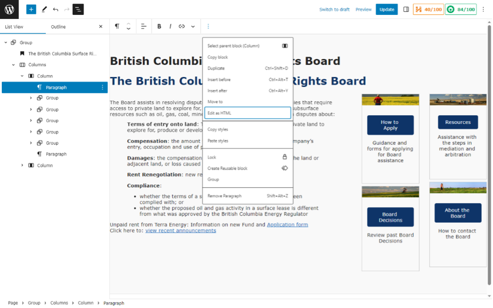
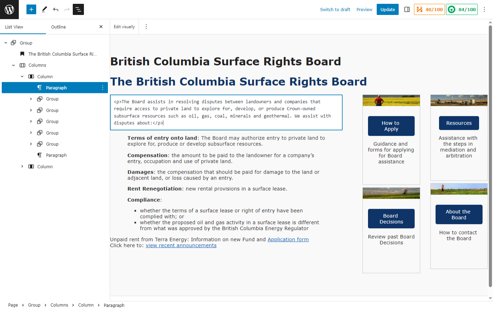
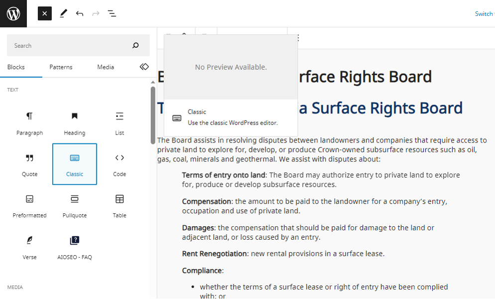
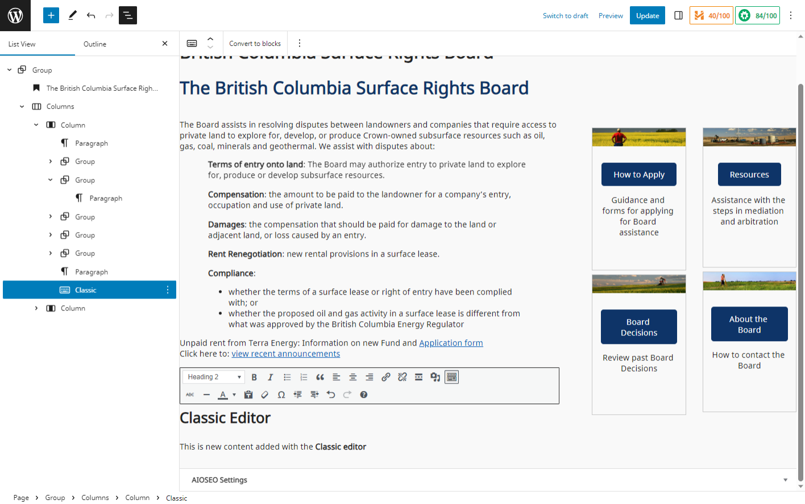
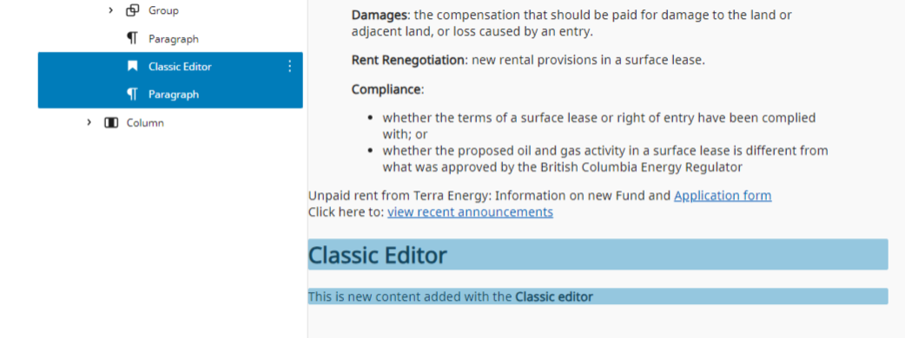

# HTML - Classic Editor

## HTML View

Content can be viewed or edited in HTML if needed.
- Select or highlight the content or object you with to edit the HTML on.
  - The document overview panel maybe used if selecting blocks of content.
- From the options menu (three vertical dots), selecting ‘Edit as HTML’ will display the selected content with its HTML tags.
  - The options menu is available in the top edit bar as well as to the side of the block selected in the overview panel.

The edit view will remain until you select the ‘Edit visually’ option located in the edit bar above the page view.

## Classic Editor
When adding new content to a new or existing page you have the option of using the classic editor. It is the traditional WYSIWYG style of editor. This must be added as a block and is not available as an edit option. 
Place the cursor where you would like to insert the classic editor using the enter key. This places an empty paragraph block on the page.

Select the blue Block Inserter icon, top left corner of the screen.

The Classic editor is located in the Text section. Selecting it will add it to the page. 

A wide range of text formatting options are available through the editor. Using the HTML step outlined previously, the content can be viewed as HTML.

Multiple editor blocks maybe used on one page, allowing for specific styling and looks for that block.

Any content added with the editor is contained within the Classic block. This allows you to change the position of the editor and its content. All the content of a page can be created within the editor block. 

Deleting the editor block will delete all its content as well.

An editor block and its content can be converted to independent blocks and removing the editor.

