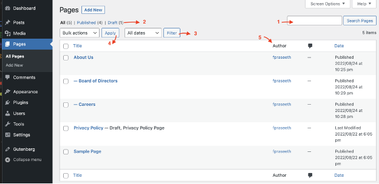
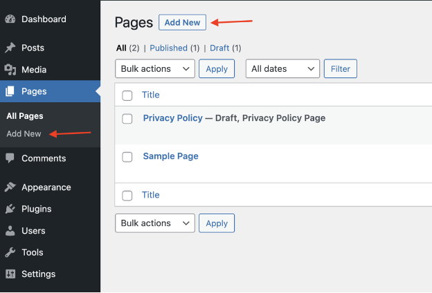
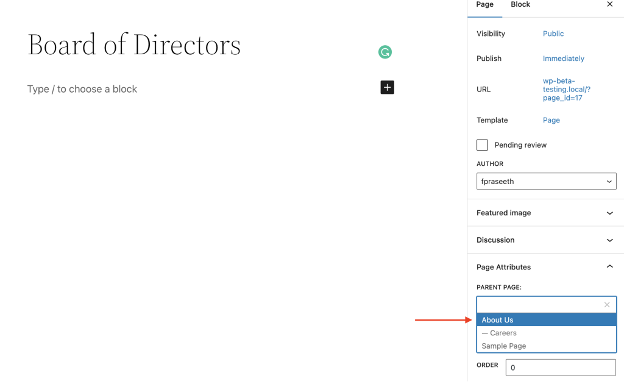
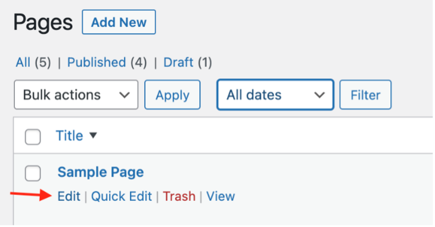
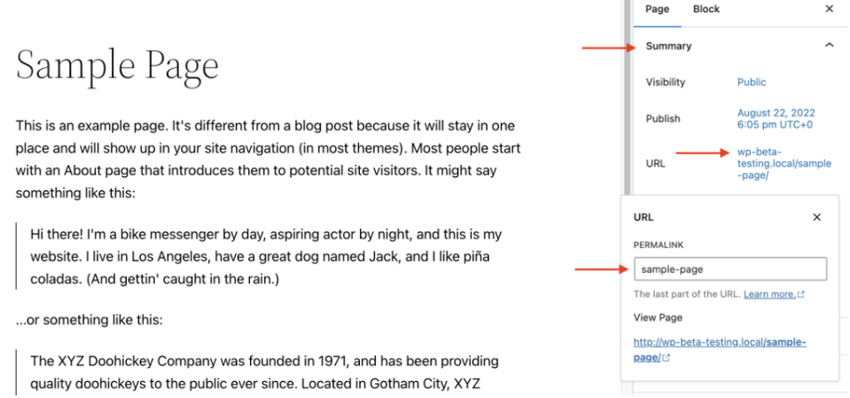
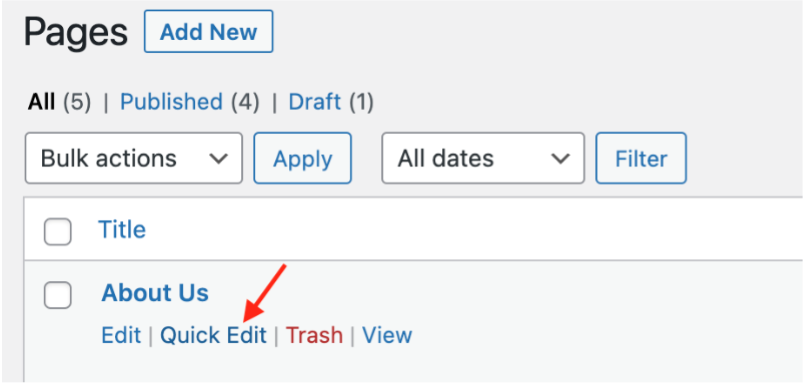
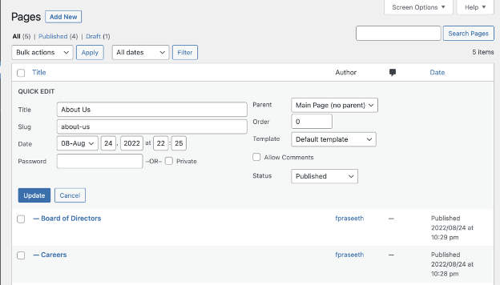

# Creating Pages

In WordPress, you can put content on your site as either a Post or a Page.

When you’re writing a regular blog entry, you write a Post. Posts, in a default setup, appear in reverse chronological order on your blog’s home page.

In contrast, Pages are for non-chronological content. Pages live outside of the normal blog chronology and are often used to present timeless information about yourself or your site – information that is always relevant. 

You can use Pages to organize and manage the structure of your website content. You can add as many pages to your site as you would like, and you can update your pages as many times as you want.

After you create a page, you can add it to your site’s navigation menu so your visitors can find it.

In general, Pages are very similar to Posts in that they both have titles and content. WordPress Theme template files maintain a consistent look throughout your site. Pages, though, have several key distinctions that make them different from Posts.

**What Pages are**
- Pages are for content that isn’t time-dependent, or which is not part of the blog content.
- Pages can be organized into parent pages and subpages.
- Pages can use different page templates, including template files, and Template Tags.
- Some themes may provide different display options for individual Pages.
- You can have a WordPress website with only Pages.

**What Pages are not**
- Pages don’t appear in the chronological view in the blog of a website.
- Pages by default do not allow taxonomy (categories, tags, and any custom taxonomies). You can enhance it via plugins.
- Pages are not files. They are stored in your database, just like Posts.
- Pages are not included in your site’s feeds. (e.g. RSS or Atom.)
- Pages and Posts can be interpreted differently by site visitors and by search engines. Search engines place more relevance on Posts because a newer post on a topic may be more relevant than a static page.
- A specific page (or a specific post) can be set as a static front page. Websites that are set up this way have a blog page that displays the latest blog posts.

## Page Screen

To view all the Pages in your site:
- Log in to your WordPress admin screen.
- Click Pages in the left sidebar. This will show the Pages screen with a list of all the pages you have in your site.

1.	You can easily search for a Page based on the Page Title.
2.	You can get a list of all the Published Pages or Draft Pages. 
3.	You can filter Pages based on dates.
4.	You can perform Bulk actions > Edit or Move to Trash by selecting multiple Pages from the list.
5.	You can sort the Pages list based on Title, Date, Author etc by clicking the Header columns.

## Organizing Pages

You can organize your Pages into parent and child pages and create a hierarchy.

For example, you can have an About Page as a parent page and create subpages under it for Careers, Board of Directors, Locations, Company Culture, Press etc. You can also have a Services Page as a parent page and create subpages for each of the services such as Web Design, Web Development, Stationery Design etc

The structure of the pages on the site would then look like this.
- About Us 
- Board of Directors
- Company Culture
- Press
- Careers
- Locations
- Services 
- Web Design
- Web Development
- Stationery Design

## Creating a New Page

To create a new Page:

1. Log in to your WordPress admin screen.
2. Click the Pages > Add New in the left sidebar.
3. Alternatively, you can also click the Add New button in the Pages screen.
4. Add a title for the page.
5. Add body content for the page. If you are using the WordPress block editor, you can use the different blocks available in the WordPress block editor to design the Page.
6. Customize the sidebar settings for the page.
7. When the page is completed, click Publish.

#### Creating a Subpage

Using Parent Pages is a good way to organize your site’s Pages into hierarchies. A parent page is a top-level page, with sub pages nested under it.

To create a subpage under a parent page:

1. Log in to your WordPress admin screen.
2. Click the Pages > Add New in the left sidebar. Alternatively, you can also click the Add New button in the Pages screen.
3. In the sidebar settings for the page, under Page Attributes, open the Parent Page drop-down menu. This will list all the Pages already created in your site.
4. Select the desired page from the drop-down menu that you want to be the parent page for the current you are creating. The current page you are creating now becomes the sub page for the parent page you choose.
5. You can change the order that your pages are displayed when using a default menu, by using the Order field of the Page Attributes module. Put the number 1 in the box for Order. This tells WordPress to display this page first on your site.
6. Add a title for the sub page.
7. Add body content for the sub page.
8. Click Publish when ready.

Repeat the process for your other sub pages you want to be disabled under a Parent page, but use higher numbers for the Order field: 2, 3, etc. This tells WordPress to display these pages second and third on your site.

When your Pages are listed, the child Page will be nested under the parent Page. The Permalinks of your Pages will also reflect this page hierarchy. In the above example, the Permalink for the Board of Directors Page would be:

http://example.com/about/board-of-directors/

#### Changing the Page URL

The slug is the part of the URL that refers to that specific page. WordPress automatically generates the slug when you give a page, post, category, or tag a title. For media items, the file name on your computer or device is used for the permalink.

**Note:** Do not change them after the page is published, unless absolutely necessary. Changing the slug will alter the URL and break existing links or menu options.

## Using the Edit option

To change the URL (also referred to as “slug”) containing the name of your Page, hover over the Page title of the Page in the Pages screen and select Edit.

In the Page Sidebar settings, under Summary click the URL link to open the URL popup. Change the Permalink entry to change the URL of the page

As you type in a new URL in the Permalink field, you can view the updated Page URL under View Page.

Select Update to save the new URL changes.

#### Using the Quick Edit Option

To change the URL (also referred to as “slug”) containing the name of your Page, hover over the Page title of the Page in the Pages screen and select Quick Edit.

This will open a Quick Edit Panel while you are still in the Pages screen. The Quick Edit panel allows you to modify page details such as Title, Slug, Date, Author. You can also Password protect the page or mark the page as Private. You can also change the Parent page, page order, template for the page and the Status of the page between Published, Pending Review and Draft

Select **Update** button to save the changes.

**Things to keep in mind:**

- Keep the url/slug simple.
- Avoid duplicating titles. If a slug appears with an "-2" attached to the end, it indicates a slug already exists by that title. It can pick up existing slugs from any pages in the trash.
